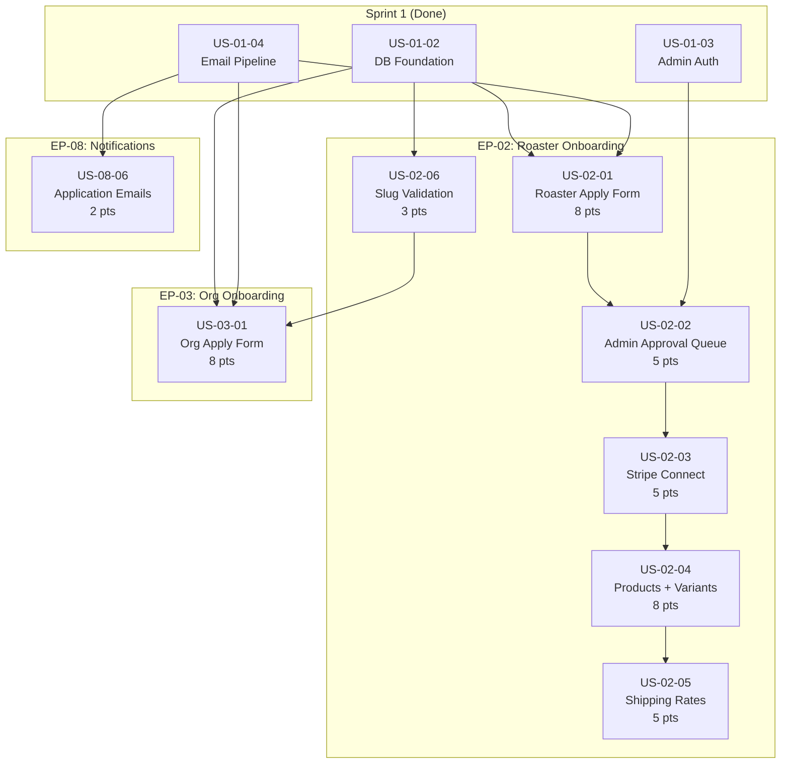

# Sprint 2 — Roaster Onboarding & Org Application

**Sprint:** 2 (Weeks 3-4) | **Points:** 44 | **Stories:** 8
**Epics:** EP-02 (Roaster Onboarding), EP-03 (Org Onboarding), EP-08 (Notifications)
**Audience:** AI coding agents, developers
**Companion documents:**
- Checklist: [`docs/SPRINT_2_CHECKLIST.md`](../SPRINT_2_CHECKLIST.md)
- Progress tracker: [`docs/SPRINT_2_PROGRESS.md`](../SPRINT_2_PROGRESS.md)
- Stories: [`docs/sprint-2/stories/`](./stories/)

---

## Sprint 2 objective

Build the first real user-facing onboarding flows: roaster application form, admin approval queue, Stripe Connect onboarding, product/variant creation, shipping configuration, slug validation, org application form, and transactional notification emails. Sprint 1 laid the technical scaffold (schema, Stripe package, checkout, webhooks, email pipeline, auth); Sprint 2 wires those foundations into working product surfaces.

---

## Epics and stories

### EP-02 — Roaster Onboarding (36 pts)

| Story ID | Title | Pts | Priority | Dependencies | App/Package |
|----------|-------|-----|----------|--------------|-------------|
| US-02-01 | Roaster application form (5 steps) on main site | 8 | High | US-01-02, US-01-04 | `apps/web` |
| US-02-02 | Admin approval queue for roaster applications | 5 | High | US-02-01, US-01-03 | `apps/admin` |
| US-02-03 | Stripe Connect Express onboarding for roasters | 5 | High | US-02-02 | `apps/roaster` |
| US-02-04 | Product and variant creation with wholesale/retail pricing | 8 | High | US-02-03 | `apps/roaster` |
| US-02-05 | Roaster shipping rate configuration | 5 | High | US-02-04 | `apps/roaster` |
| US-02-06 | Slug reservation blocklist validation | 3 | Medium | US-01-02 | `apps/web`, `packages/types` |

### EP-03 — Org Onboarding (8 pts)

| Story ID | Title | Pts | Priority | Dependencies | App/Package |
|----------|-------|-----|----------|--------------|-------------|
| US-03-01 | Org application form (5 steps) on main site | 8 | High | US-01-02, US-01-04, US-02-06 | `apps/web` |

### EP-08 — Notifications (2 pts)

| Story ID | Title | Pts | Priority | Dependencies | App/Package |
|----------|-------|-----|----------|--------------|-------------|
| US-08-06 | Application received and approval/rejection notifications | 2 | High | US-01-04 | `packages/email` |

---

## Dependency graph

---

## Recommended implementation order

Based on dependencies, the stories should be implemented in this sequence:

| Order | Story | Rationale |
|-------|-------|-----------|
| 1 | US-08-06 | Email templates have no upstream dependencies beyond Sprint 1; other stories call these templates |
| 2 | US-02-06 | Slug validation is a standalone utility needed by US-03-01 |
| 3 | US-02-01 | Roaster apply form — first in the main dependency chain |
| 4 | US-02-02 | Admin approval queue — depends on applications existing |
| 5 | US-02-03 | Stripe Connect onboarding — depends on approved roasters existing |
| 6 | US-02-04 | Product/variant CRUD — depends on roaster having active Stripe |
| 7 | US-02-05 | Shipping rate config — depends on product system existing |
| 8 | US-03-01 | Org apply form — depends on slug validation and follows roaster path pattern |

Parallelization opportunity: US-08-06, US-02-06, and US-02-01 can run concurrently since they share only Sprint 1 dependencies.

---

## Story-to-file mapping

| Story | Primary files to create or modify |
|-------|----------------------------------|
| US-02-01 | `apps/web/app/[locale]/roasters/apply/page.tsx`, `apps/web/app/[locale]/roasters/apply/_components/`, `apps/web/app/[locale]/roasters/apply/_actions/submit-application.ts` |
| US-02-02 | `apps/admin/app/approvals/roasters/page.tsx`, `apps/admin/app/approvals/roasters/_actions/`, `apps/admin/app/approvals/roasters/_components/` |
| US-02-03 | `apps/roaster/app/(authenticated)/onboarding/page.tsx`, `apps/roaster/app/(authenticated)/onboarding/_components/` |
| US-02-04 | `apps/roaster/app/(authenticated)/products/page.tsx`, `apps/roaster/app/(authenticated)/products/new/page.tsx`, `apps/roaster/app/(authenticated)/products/[id]/edit/page.tsx`, `apps/roaster/app/(authenticated)/products/_actions/`, `apps/roaster/app/(authenticated)/products/_components/` |
| US-02-05 | `apps/roaster/app/(authenticated)/settings/shipping/page.tsx`, `apps/roaster/app/(authenticated)/settings/shipping/_actions/`, `apps/roaster/app/(authenticated)/settings/shipping/_components/` |
| US-02-06 | `apps/web/app/api/slugs/validate/route.ts` |
| US-03-01 | `apps/web/app/[locale]/orgs/apply/page.tsx`, `apps/web/app/[locale]/orgs/apply/_components/`, `apps/web/app/[locale]/orgs/apply/_actions/submit-application.ts` |
| US-08-06 | `packages/email/templates/roaster-application-received.tsx`, `packages/email/templates/roaster-approved.tsx`, `packages/email/templates/roaster-rejected.tsx`, `packages/email/templates/org-application-received.tsx` |

---

## Diagram references

These mermaid diagrams are the source of truth for Sprint 2 flows. Every story references the relevant diagram(s). The codebase must stay aligned with these diagrams; if implementation reveals a needed change, update the diagram in the same PR.

| Diagram | Path | Sprint 2 relevance |
|---------|------|--------------------|
| Approval Chain | [`docs/05-approval-chain.mermaid`](../05-approval-chain.mermaid) | Primary reference for US-02-01, US-02-02, US-02-03, US-03-01 — defines the full roaster and org onboarding state machines |
| Database Schema | [`docs/06-database-schema.mermaid`](../06-database-schema.mermaid) | All stories — ERD for `RoasterApplication`, `Roaster`, `Product`, `ProductVariant`, `RoasterShippingRate`, `OrgApplication`, `RoasterOrgRequest`, `Org` |
| Project Structure | [`docs/01-project-structure.mermaid`](../01-project-structure.mermaid) | Route and file layout reference for all apps |
| Stripe Payment Flow | [`docs/07-stripe-payment-flow.mermaid`](../07-stripe-payment-flow.mermaid) | US-02-03 — Connect Express onboarding flow |
| Package Dependencies | [`docs/03-package-dependencies.mermaid`](../03-package-dependencies.mermaid) | Import relationships between apps and packages |

---

## Document references

| Document | Path | Sprint 2 relevance |
|----------|------|--------------------|
| AGENTS.md | [`docs/AGENTS.md`](../AGENTS.md) | Tenant isolation, money-as-cents, soft deletes, sendEmail rules, Stripe singleton, webhook idempotency, magic links |
| CONVENTIONS.md | [`docs/CONVENTIONS.md`](../CONVENTIONS.md) | Server/client component patterns, API route structure, query patterns with tenant scoping and soft delete filtering, naming conventions |
| DB Schema Reference | [`docs/joe_perks_db_schema.md`](../joe_perks_db_schema.md) | Prisma model documentation and design decisions |
| Scaffold Checklist | [`docs/SCAFFOLD_CHECKLIST.md`](../SCAFFOLD_CHECKLIST.md) | Sprint 1 baseline — what is done |
| Scaffold Progress | [`docs/SCAFFOLD_PROGRESS.md`](../SCAFFOLD_PROGRESS.md) | Current-state tracker for Sprint 1 scaffold |

---

## Key AGENTS.md rules for Sprint 2

These rules from [`docs/AGENTS.md`](../AGENTS.md) apply directly to Sprint 2 work:

1. **Money as cents** — All prices (`retailPrice`, `wholesalePrice`, `flatRate`) are `Int` cents. Display: `(cents / 100).toFixed(2)`.
2. **Tenant isolation** — Roaster portal queries must include `WHERE roasterId = session.roasterId`. Admin queries may scope globally.
3. **Soft deletes** — `Product` and `ProductVariant` queries must filter `WHERE deletedAt IS NULL`.
4. **sendEmail()** — Always use `sendEmail()` from `@joe-perks/email`. Never import Resend directly. `EmailLog` dedup on `(entityType, entityId, template)`.
5. **Stripe** — Never import Stripe directly in apps. Use `@joe-perks/stripe`. Webhook handlers must verify signatures and check `StripeEvent` for idempotency.
6. **Logging** — Never log `req.body` or PII. Only log `order_id`, `stripe_pi_id`, `event_type`, `campaign_id`.

---

## Prisma models touched by Sprint 2

All models already exist in `packages/db/prisma/schema.prisma`. No migrations are expected unless implementation reveals a gap.

| Model | Stories | Key fields |
|-------|---------|------------|
| `RoasterApplication` | US-02-01, US-02-02 | `status` (`ApplicationStatus`), `email`, `businessName`, `termsAgreedAt`, `termsVersion` |
| `Roaster` | US-02-02, US-02-03, US-02-04, US-02-05 | `status` (`RoasterStatus`), `stripeAccountId`, `stripeOnboarding` (`StripeOnboardingStatus`), `chargesEnabled`, `payoutsEnabled` |
| `User` | US-02-02 | `externalAuthId`, `role` (`UserRole`), `roasterId` |
| `Product` | US-02-04 | `roasterId`, `name`, `roastLevel` (`RoastLevel`), `status` (`ProductStatus`), `deletedAt` |
| `ProductVariant` | US-02-04 | `productId`, `sizeOz`, `grind` (`GrindOption`), `wholesalePrice`, `retailPrice`, `isAvailable`, `deletedAt` |
| `RoasterShippingRate` | US-02-05 | `roasterId`, `label`, `carrier`, `flatRate`, `isDefault` |
| `OrgApplication` | US-03-01 | `status` (`OrgApplicationStatus`), `email`, `desiredSlug`, `desiredOrgPct` |
| `RoasterOrgRequest` | US-03-01 | `applicationId`, `roasterId`, `status` (`RoasterOrgRequestStatus`), `priority` |
| `Org` | US-02-06 | `slug` (uniqueness check) |
| `EmailLog` | US-08-06 | `entityType`, `entityId`, `template` (dedup) |
