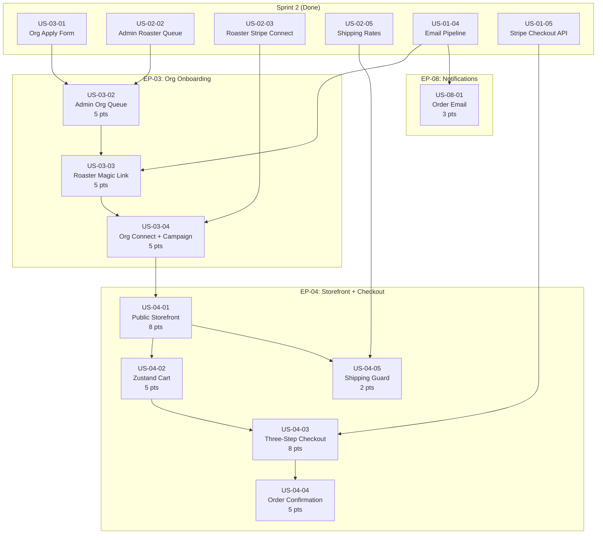

# Sprint 3 — Org Onboarding + Buyer Storefront

**Sprint:** 3 (Weeks 5-6) | **Points:** 46 | **Stories:** 9
**Epics:** EP-03 (Org Onboarding), EP-04 (Buyer Storefront & Checkout), EP-08 (Notifications)
**Audience:** AI coding agents, developers
**Companion documents:**
- Checklist: [`docs/SPRINT_3_CHECKLIST.md`](../SPRINT_3_CHECKLIST.md)
- Progress tracker: [`docs/SPRINT_3_PROGRESS.md`](../SPRINT_3_PROGRESS.md)
- Stories: [`docs/sprint-3/stories/`](./stories/)

**Current progress:** All Sprint 3 stories are **Done** (**US-03-02** through **US-04-05** and **US-08-01**). Sprint 2 is complete (8/8 stories done). Details: [`docs/SPRINT_3_PROGRESS.md`](../SPRINT_3_PROGRESS.md), [`docs/SPRINT_2_PROGRESS.md`](../SPRINT_2_PROGRESS.md).

---

## Sprint 3 objective

Complete the org onboarding approval chain (admin org queue, roaster magic-link review, org Stripe Connect, campaign creation) and build the buyer-facing storefront with cart, three-step checkout, order confirmation, and transactional email. Sprint 2 delivered roaster onboarding end-to-end and the org application form; Sprint 3 connects those foundations into working buyer commerce surfaces and closes the org onboarding loop.

---

## Epics and stories

### EP-03 — Org Onboarding (15 pts)

| Story ID | Title | Pts | Priority | Dependencies | App/Package |
|----------|-------|-----|----------|--------------|-------------|
| US-03-02 | Admin org approval queue with routing to roaster review | 5 | High | US-03-01, US-02-02 | `apps/admin` |
| US-03-03 | Roaster magic link approval/decline of org | 5 | High | US-03-02, US-01-04 | `apps/roaster` |
| US-03-04 | Org Stripe Connect onboarding and campaign creation | 5 | High | US-03-03, US-02-03 | `apps/org` |

### EP-04 — Buyer Storefront & Checkout (28 pts)

| Story ID | Title | Pts | Priority | Dependencies | App/Package |
|----------|-------|-----|----------|--------------|-------------|
| US-04-01 | Public org storefront at joeperks.com/[slug] | 8 | High | US-03-04 | `apps/web` |
| US-04-02 | Zustand cart with add, remove, quantity update | 5 | High | US-04-01 | `packages/ui`, `apps/web` |
| US-04-03 | Three-step checkout: cart review, shipping details, payment | 8 | High | US-04-02, US-01-05 | `apps/web` |
| US-04-04 | Order confirmation page with payment status polling | 5 | High | US-04-03 | `apps/web` |
| US-04-05 | Shipping rate availability guard on storefront and checkout | 2 | Low | US-02-05, US-04-01 | `apps/web` |

### EP-08 — Notifications (3 pts)

| Story ID | Title | Pts | Priority | Dependencies | App/Package |
|----------|-------|-----|----------|--------------|-------------|
| US-08-01 | Order confirmation email to buyer | 3 | High | US-01-04, US-05-01 | `packages/email`, `apps/web` |

---

## Dependency graph

---

## Recommended implementation order

Based on dependencies, the stories should be implemented in this sequence:

| Phase | Story | Rationale |
|-------|-------|-----------|
| 1 | US-03-02 | Admin org approval queue -- first in the EP-03 chain; depends only on Sprint 2 |
| 2 | US-03-03 | Roaster magic link review -- depends on admin queue routing the magic link |
| 3 | US-03-04 | Org Stripe Connect + campaign -- depends on roaster approval of org |
| 4 | US-04-01 | Public storefront -- depends on campaign being ACTIVE |
| 5 | US-08-01 | Order confirmation email -- can parallel with Phase 4; depends only on Sprint 1 email pipeline |
| 6 | US-04-02 | Zustand cart -- depends on storefront product grid |
| 7 | US-04-03 | Three-step checkout -- depends on cart; calls existing `create-intent` API |
| 8 | US-04-04 | Order confirmation page -- depends on checkout completing |
| 9 | US-04-05 | Shipping rate guard -- low priority; can parallel with Phases 7-8 |

Parallelization opportunities: US-08-01 and US-04-05 share no dependencies with the main EP-04 chain and can run concurrently with other phases.

---

## Story-to-file mapping

| Story | Primary files to create or modify |
|-------|----------------------------------|
| US-03-02 | `apps/admin/app/approvals/orgs/page.tsx`, `[id]/page.tsx`, `_actions/approve-application.ts`, `_actions/reject-application.ts`, `_components/`, `_lib/` |
| US-03-03 | `apps/roaster/app/org-requests/[token]/page.tsx`, `_actions/approve-org.ts`, `_actions/decline-org.ts`, `_components/`, `_lib/`, `packages/email/templates/org-approved.tsx`, `org-declined.tsx` (roaster review email template `org-roaster-review.tsx` is US-03-02) |
| US-03-04 | `apps/org/app/(authenticated)/onboarding/`, `(authenticated)/campaign/` (`_actions/`, `_components/`, `_lib/`), `(authenticated)/_lib/require-org.ts`, `apps/org/app/api/stripe/connect/route.ts`, `load-root-env.ts` |
| US-04-01 | `apps/web/app/[locale]/[slug]/page.tsx`, `_lib/queries.ts`, `_lib/format.ts`, `_components/storefront-layout.tsx`, `product-grid.tsx`, `product-card.tsx`, `campaign-header.tsx`; `packages/db/scripts/smoke-us-04-01-storefront.ts` |
| US-04-02 | `packages/ui/src/store/cart.ts` (expand), `apps/web` → `@joe-perks/ui`; `apps/web/app/[locale]/[slug]/_components/cart-drawer.tsx`, `cart-line-item.tsx`, `add-to-cart-button.tsx`, `cart-trigger.tsx`, `storefront-cart-sync.tsx`; `cart-drawer` imports `calculateSplits` from `@joe-perks/stripe/splits` (client-safe) |
| US-04-03 | `apps/web/app/[locale]/[slug]/checkout/page.tsx`, `_components/checkout-form.tsx`, `step-cart-review.tsx`, `step-shipping.tsx`, `step-payment.tsx`, `_lib/schema.ts` |
| US-04-04 | `apps/web/app/[locale]/[slug]/order/[pi_id]/page.tsx`, `_components/order-status-poller.tsx`, `order-summary.tsx`, `order-processing.tsx` |
| US-08-01 | `packages/email/templates/order-confirmation.tsx`, `apps/web/app/api/webhooks/stripe/route.ts` (`sendBuyerOrderConfirmationEmail` → `sendEmail`, template `order_confirmation`) |
| US-04-05 | `apps/web/app/[locale]/[slug]/_lib/queries.ts` (`hasShippingRates`, `shippingRates`), `_components/shipping-guard.tsx`, `page.tsx` (banner + disabled purchase UI), `checkout/page.tsx` (redirect when no rates) |

---

## Diagram references

These mermaid diagrams are the source of truth for Sprint 3 flows. Every story references the relevant diagram(s). The codebase must stay aligned with these diagrams; if implementation reveals a needed change, update the diagram in the same PR.

| Diagram | Path | Sprint 3 relevance |
|---------|------|--------------------|
| Approval Chain | [`docs/05-approval-chain.mermaid`](../05-approval-chain.mermaid) | Primary reference for US-03-02, US-03-03, US-03-04 -- defines the full org onboarding state machine (OA3-OA13) |
| Order Lifecycle | [`docs/04-order-lifecycle.mermaid`](../04-order-lifecycle.mermaid) | US-04-03, US-04-04, US-08-01 -- checkout, webhook confirmation, buyer email |
| Database Schema | [`docs/06-database-schema.mermaid`](../06-database-schema.mermaid) | All stories -- ERD for `OrgApplication`, `RoasterOrgRequest`, `Org`, `Campaign`, `CampaignItem`, `Order`, `OrderItem`, `MagicLink`, `Buyer` |
| Stripe Payment Flow | [`docs/07-stripe-payment-flow.mermaid`](../07-stripe-payment-flow.mermaid) | US-04-03 -- charge creation, split math, PaymentIntent |
| Order State Machine | [`docs/08-order-state-machine.mermaid`](../08-order-state-machine.mermaid) | US-04-04 -- PENDING to CONFIRMED transition, payout status |
| Project Structure | [`docs/01-project-structure.mermaid`](../01-project-structure.mermaid) | Route and file layout reference for all apps |
| Package Dependencies | [`docs/03-package-dependencies.mermaid`](../03-package-dependencies.mermaid) | Import relationships between apps and packages |
| Deployment Topology | [`docs/02-deployment-topology.mermaid`](../02-deployment-topology.mermaid) | DNS and Vercel configuration for storefront routing |

---

## Document references

| Document | Path | Sprint 3 relevance |
|----------|------|--------------------|
| AGENTS.md | [`docs/AGENTS.md`](../AGENTS.md) | Tenant isolation, money-as-cents, soft deletes, sendEmail rules, Stripe singleton, webhook idempotency, magic link validation, split calculations |
| CONVENTIONS.md | [`docs/CONVENTIONS.md`](../CONVENTIONS.md) | Server/client component patterns, server action shape, portal route structure, CampaignItem price snapshots, storefront component patterns, cart interaction |
| DB Schema Reference | [`docs/joe_perks_db_schema.md`](../joe_perks_db_schema.md) | Prisma model documentation, design decisions, price snapshotting |
| Design Specs | [`docs/joe_perks_design_specs.md`](../joe_perks_design_specs.md) | Marketing site design system, color tokens, typography, responsive breakpoints |
| Sprint 2 Checklist | [`docs/SPRINT_2_CHECKLIST.md`](../SPRINT_2_CHECKLIST.md) | Sprint 2 baseline -- what is done |
| Sprint 2 Progress | [`docs/SPRINT_2_PROGRESS.md`](../SPRINT_2_PROGRESS.md) | Current-state tracker for Sprint 2 |
| Scaffold Checklist | [`docs/SCAFFOLD_CHECKLIST.md`](../SCAFFOLD_CHECKLIST.md) | Sprint 1 baseline |

---

## Key AGENTS.md rules for Sprint 3

These rules from [`docs/AGENTS.md`](../AGENTS.md) apply directly to Sprint 3 work:

1. **Money as cents** -- All prices (`retailPrice`, `wholesalePrice`, `flatRate`, `grossAmount`, split fields) are `Int` cents. Display: `(cents / 100).toFixed(2)`.
2. **Split calculations** -- Always use `calculateSplits()`. **Server / API:** import from `@joe-perks/stripe`. **Client UI (cart estimate):** import from `@joe-perks/stripe/splits` only — the main package barrel pulls `server-only` modules. Splits are frozen on the `Order` row at PaymentIntent creation time. Never recalculate persisted order splits.
3. **CampaignItem price snapshots** -- Storefront and checkout must read `CampaignItem.retailPrice`, never `ProductVariant.retailPrice` (variant prices may have changed since campaign creation).
4. **Tenant isolation** -- Roaster portal queries must scope by `session.roasterId`. Org portal queries must scope by `session.orgId`. Admin queries may scope globally.
5. **Magic links** -- Tokens generated with `crypto.randomBytes(32).toString('hex')`. Single-use: set `used_at = now()` before any action. Verify: token exists, `expires_at > now()`, `used_at IS NULL`, correct `purpose`. Magic link pages are accessible WITHOUT authentication.
6. **Soft deletes** -- `Product`/`ProductVariant` queries must filter `WHERE deletedAt IS NULL`.
7. **sendEmail()** -- Always use `sendEmail()` from `@joe-perks/email`. Never import Resend directly. `EmailLog` dedup on `(entityType, entityId, template)`. Buyer order confirmation uses template **`order_confirmation`** from the **`payment_intent.succeeded`** webhook (`apps/web`).
8. **Stripe** -- Never import the **server** Stripe SDK in apps; use `@joe-perks/stripe` on the server. For **client** split previews, use `@joe-perks/stripe/splits`. For **Stripe Elements** (checkout), use **`@stripe/react-stripe-js`** / **`@stripe/stripe-js`** only. Webhook handlers must verify signatures and check `StripeEvent` for idempotency.
9. **Webhook idempotency** -- Check `StripeEvent` before processing; return 200 on duplicate. (`apps/web` records the event **after** successful handling — see [`docs/AGENTS.md`](../AGENTS.md) webhook note.)
10. **Logging** -- Never log `req.body` or PII. Only log IDs and event types.

---

## Key CONVENTIONS.md patterns for Sprint 3

1. **Server components** for storefront and checkout shells -- `getStorefrontData` loads `Campaign`, `CampaignItem`, `Org`, `hasShippingRates`, `shippingRates`, `splitPreviewDefaults`.
2. **Client components** for cart and checkout -- `useCartStore` from `@joe-perks/ui`, add-to-cart, cart drawer, **`checkout-form`** (steps + Stripe Elements), **`order-status-poller`** on the confirmation page.
3. **Portal route structure** -- `_actions/`, `_components/`, `_lib/` under route segments for org portal campaign CRUD.
4. **Server actions** for org portal mutations -- `requireOrgId()` pattern (mirrors `requireRoasterId()`).
5. **CampaignItem prices** -- Always read `CampaignItem.retailPrice` for storefront display and checkout, not `ProductVariant.retailPrice`.
6. **API routes** -- Validate, then business logic, then `Response.json()`. Rate limit where appropriate.
7. **Client split preview** -- `calculateSplits` from `@joe-perks/stripe/splits` in cart drawer; `getStorefrontData` supplies `splitPreviewDefaults`.
8. **Shipping guard (US-04-05)** -- When `hasShippingRates` is false, show **`ShippingGuard`**, disable purchase CTAs, and redirect checkout to the storefront with `?error=no-shipping`.

---

## Prisma models touched by Sprint 3

| Model | Stories | Key fields |
|-------|---------|------------|
| `OrgApplication` | US-03-02, US-03-03 | `status` (`OrgApplicationStatus`), `desiredSlug`, `desiredOrgPct`, `orgName`, `contactName` |
| `RoasterOrgRequest` | US-03-02, US-03-03 | `status` (`RoasterOrgRequestStatus`), `priority`, `applicationId`, `roasterId` |
| `MagicLink` | US-03-02, US-03-03 | `token`, `purpose` (`ROASTER_REVIEW`), `actorId`, `expiresAt`, `usedAt` |
| `Org` | US-03-03, US-03-04, US-04-01 | `slug`, `status`, `stripeAccountId`, `stripeOnboarding`, `chargesEnabled`, `payoutsEnabled`, `applicationId` |
| `Campaign` | US-03-04, US-04-01, US-04-03 | `status` (`CampaignStatus`), `orgPct`, `orgId`, `goalCents` |
| `CampaignItem` | US-03-04, US-04-01, US-04-02, US-04-03 | `retailPrice`, `wholesalePrice`, `campaignId`, `variantId`, `isFeatured` |
| `Product` | US-04-01 | `name`, `roastLevel`, `imageUrl`, `deletedAt` |
| `ProductVariant` | US-03-04, US-04-01 | `sizeOz`, `grind`, `isAvailable`, `deletedAt` |
| `Roaster` | US-03-03, US-04-01 | `status` (`ACTIVE`), `stripeAccountId` |
| `RoasterShippingRate` | US-04-03, US-04-05 | `flatRate`, `label`, `carrier`, `isDefault`, `roasterId` |
| `Order` | US-04-03, US-04-04, US-08-01 | Frozen splits, `status`, `stripePiId`, `orderNumber`, `buyerIp` |
| `OrderItem` | US-04-03, US-04-04 | Snapshot fields: `productName`, `variantDesc`, `unitPrice`, `lineTotal` |
| `OrderEvent` | US-04-03 | `eventType` (`PAYMENT_INTENT_CREATED`), `actorType`, `ipAddress` |
| `Buyer` | US-04-03, US-08-01 | `email` (unique, upsert), `name` |
| `EmailLog` | US-08-01 | `entityType`, `entityId`, `template` (dedup) |
| `User` | US-03-03 | `orgId` (set when org record created) |
