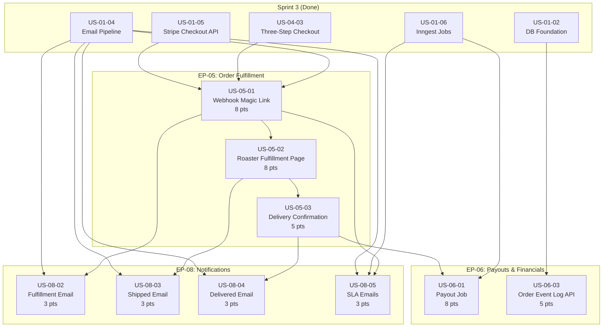

# Sprint 4 — Order Fulfillment, Payouts & Notifications

**Sprint:** 4 (Weeks 7-8) | **Points:** 46 | **Stories:** 9
**Epics:** EP-05 (Order Fulfillment), EP-06 (Payouts & Financials), EP-08 (Notifications)
**Audience:** AI coding agents, developers
**Companion documents:**
- Checklist: [`docs/SPRINT_4_CHECKLIST.md`](../SPRINT_4_CHECKLIST.md)
- Progress tracker: [`docs/SPRINT_4_PROGRESS.md`](../SPRINT_4_PROGRESS.md)
- Stories: [`docs/sprint-4/stories/`](./stories/)

**Current progress:** All Sprint 4 stories are at `Todo`. Sprint 3 is complete (9/9 stories done). Details: [`docs/SPRINT_3_PROGRESS.md`](../SPRINT_3_PROGRESS.md).

---

## Sprint 4 objective

Complete the post-checkout order lifecycle: extend the `payment_intent.succeeded` webhook to generate roaster fulfillment magic links, build the magic link fulfillment page (order view + tracking entry), implement delivery confirmation with payout eligibility calculation, verify the Inngest daily payout job end-to-end, create the `logOrderEvent` helper and order event query API, and wire four transactional email templates (fulfillment notification, shipped, delivered, SLA escalations). Sprint 3 delivered the buyer storefront, cart, checkout, and order confirmation; Sprint 4 connects confirmed orders to roaster fulfillment and automated payouts, closing the order lifecycle defined in `docs/04-order-lifecycle.mermaid` Phases 2-5.

---

## Epics and stories

### EP-05 — Order Fulfillment (21 pts)

| Story ID | Title | Pts | Priority | Dependencies | App/Package |
|----------|-------|-----|----------|--------------|-------------|
| US-05-01 | payment_intent.succeeded webhook creates order and sends fulfillment magic link | 8 | High | US-01-05, US-04-03, US-01-04 | `apps/web` |
| US-05-02 | Roaster magic link fulfillment page: view order and submit tracking | 8 | High | US-05-01 | `apps/roaster` |
| US-05-03 | Delivery confirmation and payout eligibility calculation | 5 | High | US-05-02 | `apps/admin`, `apps/web` |

### EP-06 — Payouts & Financials (13 pts)

| Story ID | Title | Pts | Priority | Dependencies | App/Package |
|----------|-------|-----|----------|--------------|-------------|
| US-06-01 | Inngest daily payout job: find eligible orders and create Stripe transfers | 8 | High | US-05-03, US-01-06 | `apps/web` |
| US-06-03 | Order event log append-only writes and query API | 5 | High | US-01-02 | `packages/db`, `apps/web`, `apps/admin` |

### EP-08 — Notifications (12 pts)

| Story ID | Title | Pts | Priority | Dependencies | App/Package |
|----------|-------|-----|----------|--------------|-------------|
| US-08-02 | Roaster magic link fulfillment notification email | 3 | High | US-01-04, US-05-01 | `packages/email`, `apps/web` |
| US-08-03 | Shipped notification email to buyer with tracking | 3 | High | US-01-04, US-05-02 | `packages/email`, `apps/roaster` |
| US-08-04 | Delivery confirmation + impact email to buyer | 3 | High | US-01-04, US-05-03 | `packages/email`, `apps/web`, `apps/admin` |
| US-08-05 | SLA warning and breach notification emails | 3 | Medium | US-01-04, US-01-06, US-05-01 | `packages/email`, `apps/web` |

---

## Dependency graph

---

## Recommended implementation order

Based on dependencies, the stories should be implemented in this sequence:

| Phase | Story | Rationale |
|-------|-------|-----------|
| 1 | US-06-03 | Order event log helper + API -- no upstream Sprint 4 deps; enables structured event logging for all subsequent stories |
| 2 | US-05-01 | Webhook magic link creation -- extends existing webhook; first in the EP-05 chain |
| 3 | US-08-02 | Fulfillment email template -- can parallel with Phase 2; wired into webhook by US-05-01 |
| 4 | US-08-05 | SLA emails -- can parallel with Phases 2-3; verifies existing SLA job wiring completeness |
| 5 | US-05-02 | Roaster fulfillment page -- depends on magic links from US-05-01 |
| 6 | US-08-03 | Shipped email -- wired into the fulfillment page action from US-05-02 |
| 7 | US-05-03 | Delivery confirmation -- depends on shipped orders from US-05-02 |
| 8 | US-08-04 | Delivered email -- wired into delivery confirmation from US-05-03 |
| 9 | US-06-01 | Payout job verification -- depends on DELIVERED orders from US-05-03; job code already exists |

Parallelization opportunities: US-06-03, US-08-02, and US-08-05 share no Sprint 4 upstream dependencies and can run concurrently with each other. US-08-03 can parallel with US-05-03 once US-05-02 is done.

---

## Story-to-file mapping

| Story | Primary files to create or modify |
|-------|----------------------------------|
| US-05-01 | `apps/web/app/api/webhooks/stripe/route.ts` (add MagicLink creation + fulfillment email send in `handlePaymentIntentSucceeded`) |
| US-05-02 | `apps/roaster/app/fulfill/[token]/page.tsx` (replace stub), `_actions/submit-tracking.ts`, `_components/fulfillment-details.tsx`, `tracking-form.tsx`, `order-summary.tsx`, `_lib/validate-token.ts` |
| US-05-03 | `apps/admin/app/orders/page.tsx`, `[id]/page.tsx`, `_actions/confirm-delivery.ts`, `_components/order-detail.tsx`, `order-list.tsx`; `apps/web/app/api/orders/[id]/deliver/route.ts` (optional API) |
| US-06-01 | `apps/web/lib/inngest/run-payout-release.ts` (verify + add OrderEvent logging), `packages/db/scripts/smoke-us-06-01-payout.ts` |
| US-06-03 | `packages/db/log-event.ts` (create `logOrderEvent`), `packages/db/index.ts` (export), `apps/web/app/api/orders/[id]/events/route.ts`, `apps/admin/app/orders/[id]/_components/event-timeline.tsx` |
| US-08-02 | `packages/email/templates/magic-link-fulfillment.tsx`, `packages/email/index.ts` (export) |
| US-08-03 | `packages/email/templates/order-shipped.tsx` |
| US-08-04 | `packages/email/templates/order-delivered.tsx` |
| US-08-05 | `packages/email/templates/sla.tsx` (verify existing templates), `apps/web/lib/inngest/run-sla-check.tsx` (verify wiring) |

---

## Diagram references

These mermaid diagrams are the source of truth for Sprint 4 flows. Every story references the relevant diagram(s). The codebase must stay aligned with these diagrams; if implementation reveals a needed change, update the diagram in the same PR.

| Diagram | Path | Sprint 4 relevance |
|---------|------|--------------------|
| Order Lifecycle | [`docs/04-order-lifecycle.mermaid`](../04-order-lifecycle.mermaid) | Primary reference for US-05-01 (Phase 2), US-05-02 (Phase 3), US-05-03 (Phase 4), US-06-01 (Phase 5) |
| Order State Machine | [`docs/08-order-state-machine.mermaid`](../08-order-state-machine.mermaid) | US-05-01 (PENDING->CONFIRMED), US-05-02 (CONFIRMED->SHIPPED), US-05-03 (SHIPPED->DELIVERED), US-06-01 (payout status) |
| Stripe Payment Flow | [`docs/07-stripe-payment-flow.mermaid`](../07-stripe-payment-flow.mermaid) | US-06-01 -- Transfer section (payout to roaster + org), US-05-03 -- payout eligibility |
| Database Schema | [`docs/06-database-schema.mermaid`](../06-database-schema.mermaid) | All stories -- ERD for `Order`, `OrderItem`, `OrderEvent`, `MagicLink`, `Buyer`, `Roaster`, `RoasterDebt`, `EmailLog` |
| Project Structure | [`docs/01-project-structure.mermaid`](../01-project-structure.mermaid) | Route and file layout reference for all apps |
| Package Dependencies | [`docs/03-package-dependencies.mermaid`](../03-package-dependencies.mermaid) | Import relationships between apps and packages |
| Approval Chain | [`docs/05-approval-chain.mermaid`](../05-approval-chain.mermaid) | Context for roaster/org Stripe account readiness (payout prerequisites) |
| Deployment Topology | [`docs/02-deployment-topology.mermaid`](../02-deployment-topology.mermaid) | Inngest + Resend service connections for payout job and emails |

---

## Document references

| Document | Path | Sprint 4 relevance |
|----------|------|--------------------|
| AGENTS.md | [`docs/AGENTS.md`](../AGENTS.md) | Magic link validation, sendEmail rules, money-as-cents, Stripe singleton, webhook idempotency, OrderEvent append-only, tenant isolation, split calculations, logging/PII |
| CONVENTIONS.md | [`docs/CONVENTIONS.md`](../CONVENTIONS.md) | Server/client component patterns, server action shape, API route structure, logOrderEvent pattern, email template naming, money handling helpers |
| DB Schema Reference | [`docs/joe_perks_db_schema.md`](../joe_perks_db_schema.md) | Prisma model documentation, Order fields, OrderEvent design, MagicLink design |
| Design Specs | [`docs/joe_perks_design_specs.md`](../joe_perks_design_specs.md) | Color tokens, typography, responsive breakpoints for fulfillment page |
| Sprint 3 Checklist | [`docs/SPRINT_3_CHECKLIST.md`](../SPRINT_3_CHECKLIST.md) | Sprint 3 baseline -- what is done |
| Sprint 3 Progress | [`docs/SPRINT_3_PROGRESS.md`](../SPRINT_3_PROGRESS.md) | Current-state tracker for Sprint 3 |
| Scaffold Checklist | [`docs/SCAFFOLD_CHECKLIST.md`](../SCAFFOLD_CHECKLIST.md) | Sprint 1 baseline |

---

## Key AGENTS.md rules for Sprint 4

These rules from [`docs/AGENTS.md`](../AGENTS.md) apply directly to Sprint 4 work:

1. **Money as cents** -- All monetary values (`roasterTotal`, `orgAmount`, `platformAmount`, `shippingAmount`, `grossAmount`, transfer amounts) are `Int` cents. Display: `(cents / 100).toFixed(2)`.
2. **Split calculations** -- Always use `calculateSplits()` from `@joe-perks/stripe`. Splits are frozen on the `Order` row at PaymentIntent creation time. Never recalculate persisted order splits. Payout job reads frozen split amounts directly.
3. **Magic links** -- Tokens generated with `crypto.randomBytes(32).toString('hex')`. Single-use: set `used_at = now()` immediately on first use before any action. Verify: token exists, `expires_at > now()`, `used_at IS NULL`, correct `purpose` (`ORDER_FULFILLMENT`). Magic link pages are accessible WITHOUT authentication.
4. **sendEmail()** -- Always use `sendEmail()` from `@joe-perks/email`. Never import Resend directly. `EmailLog` dedup on `(entityType, entityId, template)`. Fulfillment email uses template `magic_link_fulfillment`; shipped uses `order_shipped`; delivered uses `order_delivered`.
5. **Stripe** -- Never import Stripe directly in apps; use `@joe-perks/stripe`. `transfer_group` must equal `order.id` on every transfer. Use `transferToConnectedAccount()` from `@joe-perks/stripe`.
6. **OrderEvent** -- Append-only: never update or delete event rows. Only insert. Use `logOrderEvent()` from `@joe-perks/db` (to be created in US-06-03).
7. **Webhook idempotency** -- Check `StripeEvent` before processing; `apps/web` records the event after successful handling. `sendEmail()` adds a second dedup layer via `EmailLog`.
8. **Tenant isolation** -- Fulfillment page uses magic link token (no auth session), but event log API on admin must scope appropriately. Payout job runs as SYSTEM actor.
9. **Logging/PII** -- Never log buyer address, email, or card data. Only log: `order_id`, `stripe_pi_id`, `event_type`, `tracking_number`.

---

## Key CONVENTIONS.md patterns for Sprint 4

1. **Magic link pages** -- No auth required. Server component validates token, loads order data, renders client form for tracking entry.
2. **Server actions** for fulfillment mutations -- `submit-tracking.ts` in `_actions/` under the fulfillment route segment.
3. **API routes** for admin delivery confirmation -- validate, business logic, `Response.json()`. Rate limit where appropriate.
4. **logOrderEvent()** pattern -- `packages/db/log-event.ts` exports a helper that wraps `database.orderEvent.create` with standard fields. Documented in CONVENTIONS.md but not yet implemented.
5. **Email templates** -- kebab-case filenames (`magic-link-fulfillment.tsx`, `order-shipped.tsx`, `order-delivered.tsx`). Templates use `BaseEmailLayout` or Tailwind + `@react-email/components`.
6. **Inngest job pattern** -- Export `runPayoutRelease()` from `apps/web/lib/inngest/run-payout-release.ts`; registered via `serve()` in `apps/web/app/api/inngest/route.ts`.
7. **Error handling** -- Background jobs (Inngest) capture to Sentry, don't re-throw for non-fatal. Critical payment paths (transfers) let errors propagate for Inngest retry.

---

## Prisma models touched by Sprint 4

| Model | Stories | Key fields |
|-------|---------|------------|
| `Order` | US-05-01, US-05-02, US-05-03, US-06-01 | `status` (CONFIRMED->SHIPPED->DELIVERED), `trackingNumber`, `carrier`, `shippedAt`, `deliveredAt`, `payoutStatus` (HELD->TRANSFERRED), `payoutEligibleAt`, `stripeTransferId`, `stripeOrgTransfer`, `fulfillBy` |
| `OrderItem` | US-05-02, US-08-02, US-08-03 | `productName`, `variantDesc`, `quantity`, `unitPrice`, `lineTotal` (snapshot fields for display) |
| `OrderEvent` | US-06-03, US-05-01, US-05-02, US-05-03, US-06-01 | `eventType` (PAYMENT_SUCCEEDED, FULFILLMENT_VIEWED, SHIPPED, DELIVERED, PAYOUT_TRANSFERRED, SLA_WARNING, SLA_BREACH), `actorType`, `actorId`, `payload`, `ipAddress` |
| `MagicLink` | US-05-01, US-05-02 | `token`, `purpose` (ORDER_FULFILLMENT), `actorId` (roasterId), `payload` ({order_id}), `expiresAt`, `usedAt` |
| `Roaster` | US-05-02, US-06-01 | `stripeAccountId`, `payoutsEnabled`, `email` (fulfillment email recipient) |
| `Campaign` | US-05-01, US-06-01, US-08-04 | `orgId`, `totalRaised` (updated on payout) |
| `Org` | US-06-01, US-08-04 | `stripeAccountId`, `slug`, `applicationId` -> `orgName` |
| `Buyer` | US-08-03, US-08-04 | `email` (shipped/delivered email recipient), `name` |
| `RoasterDebt` | US-06-01 | `roasterId`, `orderId`, `amount`, `reason`, `settled` |
| `EmailLog` | US-08-02, US-08-03, US-08-04, US-08-05 | `entityType`, `entityId`, `template` (dedup) |
| `PlatformSettings` | US-05-01, US-05-03, US-06-01, US-08-05 | `payoutHoldDays`, `slaWarnHours`, `slaBreachHours`, `slaCriticalHours`, `slaAutoRefundHours` |
