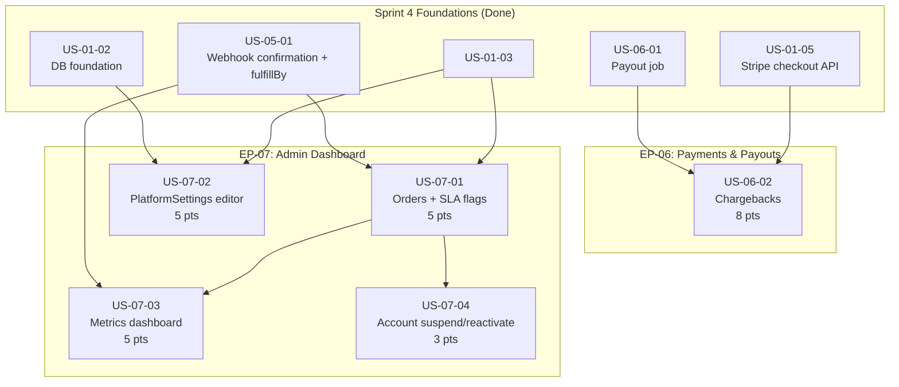

# Sprint 5 — Admin Dashboard, Chargebacks & Platform Controls

**Sprint:** 5 (Weeks 9-10) | **Points:** 26 | **Stories:** 5
**Epics:** EP-06 (Payments & Payouts), EP-07 (Admin Dashboard & Monitoring)
**Audience:** AI coding agents, developers
**Companion documents:**
- Checklist: [`docs/SPRINT_5_CHECKLIST.md`](../SPRINT_5_CHECKLIST.md)
- Progress tracker: [`docs/SPRINT_5_PROGRESS.md`](../SPRINT_5_PROGRESS.md)
- Stories: [`docs/sprint-5/stories/`](./stories/)

**Current progress:** Sprint 5 is documented, normalized, and ready for implementation planning, but not yet implemented. The repo already contains useful groundwork: Sprint 4 delivered the admin order list/detail flow, payout job, SLA automation, `DisputeRecord` schema, and admin scaffolds for disputes, settings, and home. No Sprint 5 story is fully complete on `main` today.

---

## Sprint 5 objective

Extend the platform into an operational admin surface: add chargeback webhook handling and debt recovery, upgrade the admin orders view with SLA-first monitoring, expose editable `PlatformSettings`, replace the admin home scaffold with a metrics dashboard, and add basic account lifecycle controls for roasters and orgs. Sprint 4 completed fulfillment, delivery confirmation, payouts, and SLA automation; Sprint 5 focuses on the admin and audit workflows needed for launch readiness.

---

## Current repo alignment

Before implementation, these repo realities should guide Sprint 5 work:

- `DisputeRecord`, `FaultType`, `DisputeOutcome`, `RoasterDebt`, and dispute-related diagram coverage already exist, but the Stripe webhook currently does **not** handle `charge.dispute.*`.
- `apps/admin/app/orders/` already exists, but it is a simplified MVP list/detail flow with a 200-row cap, status tabs, and no SLA indicator column, filter bar, refund action, manual payout action, or dispute panel.
- `apps/admin/app/settings/page.tsx` and `apps/admin/app/disputes/page.tsx` are scaffolds only.
- `apps/admin/app/page.tsx` is still the default Next.js starter page.
- `Roaster.status` and `Org.status` already support `SUSPENDED`, and the Stripe `account.updated` webhook already avoids re-promoting suspended roasters, but there are no admin lifecycle management pages yet.
- Several source-story terms do **not** exist in schema/code as named. Sprint 5 is normalized below so implementation can start from one coherent plan instead of resolving naming churn mid-build.

---

## Normalized implementation decisions

These decisions normalize Sprint 5 to the current platform architecture and best-practice admin UX:

- **Dispute events:** keep existing `DISPUTE_OPENED` and `DISPUTE_CLOSED` event types. Store `outcome`, `faultAttribution`, Stripe dispute status, and reversal/debt details in event payloads instead of adding `DISPUTE_WON` / `DISPUTE_LOST`.
- **Debt reasons:** keep the current `DebtReason` enum. Use `DISPUTE_LOSS` for Stripe dispute fee and non-refundable Stripe processing fee; use `CHARGEBACK` for unrecovered principal / payout-reversal shortfall when a separate row is useful.
- **Dispute state source of truth:** do **not** add `Order.isDisputed`. Admin list/detail UI should derive dispute state from the `DisputeRecord` relation.
- **Settings scope:** drop `PlatformSettings.min_retail_spread_pct` from Sprint 5. It is not in the current schema and is not required by the screenshot scope.
- **Admin audit trail:** replace the vague `ApplicationEvent` reference with a focused `AdminActionLog` planned model/helper for settings changes, suspension/reactivation, dispute fault attribution, and other high-risk admin actions.
- **Orders admin MVP scope:** keep US-07-01 focused on visibility and low-risk actions. `Mark Delivered` remains in scope; `Contact Roaster` is a `mailto:` convenience action; destructive financial actions like manual refund and manual payout are deferred until after Sprint 5 unless explicitly reprioritized.
- **Dispute threshold enforcement:** if a roaster reaches 3+ roaster-fault disputes in a trailing 90-day window, automatically set `Roaster.status = SUSPENDED`, write `AdminActionLog`, and notify admin. Reactivation remains a manual admin review action under US-07-04.
- **Reactivation UX:** reactivation is a request-and-review workflow, not a blind toggle. Suspended roasters/orgs should see a read-only status page/banner, the suspension reason category, what is blocked, a remediation checklist, and a `Request Reactivation` action. Admin sees a readiness panel before reactivation: open disputes, unsettled debt, Stripe readiness, and open undelivered orders, with optional explicit override confirmation if reactivating despite blockers.

---

## Implementation package order

Use this sequence when breaking Sprint 5 into development tasks:

| Package | Scope | Why first |
|---------|-------|-----------|
| A | Shared schema/helpers: `AdminActionLog`, shared admin actor helper, shared SLA state helper | Removes cross-story ambiguity and gives all later stories a common audit layer |
| B | US-07-01 admin orders + SLA flags | Highest-value operational screen; needed by dashboard and account review |
| C | US-07-02 settings editor | Isolated CRUD once audit helper exists |
| D | US-06-02 dispute webhook + admin dispute surfaces | Largest backend slice; depends on payout/debt foundations already in place |
| E | US-07-03 metrics dashboard | Mostly aggregation and links once orders/disputes are defined |
| F | US-07-04 account lifecycle + suspended portal UX | Best built after audit, orders, disputes, and readiness signals exist |

---

## New shared primitives

Sprint 5 should introduce these shared building blocks up front:

| Primitive | Purpose | Likely location |
|-----------|---------|-----------------|
| `AdminActionLog` model | Durable audit trail for high-risk admin actions | `packages/db/prisma/schema.prisma` |
| `logAdminAction()` helper | Thin helper around `AdminActionLog` writes | `packages/db/admin-action-log.ts` |
| `getOrderSlaState()` helper | Shared SLA color/state logic for orders UI | `apps/admin/app/orders/_lib/sla.ts` or equivalent |
| Shared admin actor helper | Normalize HTTP Basic admin identity for audit writes | `apps/admin` shared lib and/or `packages/types` |

Recommended `AdminActionLog` fields for Sprint 5: `id`, `actorLabel`, `actionType`, `targetType`, `targetId`, `note`, `payload`, `createdAt`.

---

## Deferred from source story text

These items are intentionally deferred so Sprint 5 stays buildable and safe:

| Story | Deferred item | Reason |
|-------|---------------|--------|
| US-07-01 | Manual refund from orders page | High-risk financial mutation; keep out of the initial admin monitoring surface |
| US-07-01 | Manual payout trigger | High-risk financial mutation; better handled after payout/dispute flows stabilize |
| US-06-02 | Automated Stripe evidence submission API flow | Manual export/review is sufficient for MVP and safer to ship |
| US-07-03 | Charts / BI-grade analytics | Not required for operational launch readiness |
| US-07-04 | Full compliance/support workflow | Keep account lifecycle focused on suspend/review/reactivate only |

---

## Epics and stories

### EP-06 — Payments & Payouts (8 pts)

| Story ID | Title | Pts | Priority | Dependencies | App/Package |
|----------|-------|-----|----------|--------------|-------------|
| US-06-02 | Chargeback webhook handler with fault attribution and debt creation | 8 | High | US-06-01, US-01-05 | `apps/web`, `apps/admin`, `packages/db`, `packages/stripe` |

### EP-07 — Admin Dashboard & Monitoring (18 pts)

| Story ID | Title | Pts | Priority | Dependencies | App/Package |
|----------|-------|-----|----------|--------------|-------------|
| US-07-01 | Admin order list with SLA flag indicators | 5 | High | US-05-01, US-01-03 | `apps/admin`, `packages/db` |
| US-07-02 | PlatformSettings editor in admin | 5 | Medium | US-01-02, US-01-03 | `apps/admin`, `packages/db` |
| US-07-03 | Basic metrics dashboard for admin | 5 | Medium | US-05-01, US-07-01 | `apps/admin`, `packages/db` |
| US-07-04 | Admin can manage roaster and org accounts: suspend, reactivate | 3 | Low | US-07-01 | `apps/admin`, `apps/web`, `packages/db`, `packages/email` |

**Story implementation status:** All Sprint 5 stories remain planned. See [`docs/SPRINT_5_PROGRESS.md`](../SPRINT_5_PROGRESS.md) for the codebase-readiness snapshot.

---

## Dependency graph

---

## Recommended implementation order

| Phase | Story | Rationale |
|-------|-------|-----------|
| 1 | US-07-01 | Most downstream admin dependency; extends a real existing orders surface |
| 2 | US-07-02 | Mostly isolated admin CRUD; unblocks real-time settings tuning |
| 3 | US-06-02 | Can run in parallel once Sprint 4 payout behavior is understood; largest schema/alignment review needed |
| 4 | US-07-03 | Depends on the richer orders surface and links into disputes/orders |
| 5 | US-07-04 | Lowest-risk final admin lifecycle controls once list/detail admin patterns are in place |

Parallelization opportunities: US-07-02 and US-06-02 can proceed alongside US-07-01. US-07-03 and US-07-04 should wait until the admin list/detail patterns settle.

---

## Story-to-file mapping

| Story | Primary files to create or modify |
|-------|----------------------------------|
| US-06-02 | `apps/web/app/api/webhooks/stripe/route.ts`, `apps/admin/app/disputes/page.tsx`, `apps/admin/app/orders/[id]/page.tsx`, related admin dispute components/actions, `packages/db/prisma/schema.prisma`, `packages/db/admin-action-log.ts`, payout/debt helpers |
| US-07-01 | `apps/admin/app/orders/page.tsx`, `apps/admin/app/orders/_components/order-list.tsx`, `apps/admin/app/orders/[id]/page.tsx`, `apps/admin/app/orders/_lib/sla.ts`, order detail components/actions |
| US-07-02 | `apps/admin/app/settings/page.tsx`, `apps/admin/app/settings/_actions/`, validation helpers, `packages/db/prisma/schema.prisma`, `packages/db/admin-action-log.ts` |
| US-07-03 | `apps/admin/app/page.tsx`, optional shared metrics components, links into `orders/` and `disputes/` |
| US-07-04 | New admin account detail/list routes such as `apps/admin/app/roasters/`, `apps/admin/app/orgs/`, server actions for suspend/reactivate, suspended-state views in `apps/roaster` and `apps/org`, storefront availability guards in `apps/web` if suspension blocks new orders |

---

## Diagram references

These diagrams are the source of truth for Sprint 5 flows. If implementation changes the expected workflow, update the diagram in the same PR.

| Diagram | Path | Sprint 5 relevance |
|---------|------|--------------------|
| Stripe Payment Flow | [`docs/07-stripe-payment-flow.mermaid`](../07-stripe-payment-flow.mermaid) | Primary reference for US-06-02 chargeback flow, debt recovery, and transfer reversal decisions |
| Database Schema | [`docs/06-database-schema.mermaid`](../06-database-schema.mermaid) | `PlatformSettings`, `Order`, `OrderEvent`, `DisputeRecord`, `RoasterDebt`, `Roaster`, `Org` |
| Order Lifecycle | [`docs/04-order-lifecycle.mermaid`](../04-order-lifecycle.mermaid) | Order timeline and admin intervention context for US-07-01 and US-07-03 |
| Order State Machine | [`docs/08-order-state-machine.mermaid`](../08-order-state-machine.mermaid) | SLA, refund, delivered, payout, and dispute-adjacent order states |
| Approval Chain | [`docs/05-approval-chain.mermaid`](../05-approval-chain.mermaid) | Context for org/roaster account lifecycle in US-07-04 |
| Project Structure | [`docs/01-project-structure.mermaid`](../01-project-structure.mermaid) | Route and file layout reference for new admin pages and webhook touchpoints |

---

## Document references

| Document | Path | Sprint 5 relevance |
|----------|------|--------------------|
| AGENTS.md | [`docs/AGENTS.md`](../AGENTS.md) | Webhook idempotency, `sendEmail()`, money-as-cents, SLA thresholds, admin auth model, Stripe rules |
| CONVENTIONS.md | [`docs/CONVENTIONS.md`](../CONVENTIONS.md) | Next.js route patterns, server actions, admin page conventions, mutation structure |
| DB Schema Reference | [`docs/joe_perks_db_schema.md`](../joe_perks_db_schema.md) | Model-level implementation notes for disputes, debts, payouts, and settings |
| Sprint 4 README | [`docs/sprint-4/README.md`](../sprint-4/README.md) | Baseline of delivered order lifecycle, payout, and admin order detail work |
| Sprint 4 Checklist | [`docs/SPRINT_4_CHECKLIST.md`](../SPRINT_4_CHECKLIST.md) | Prerequisite implementation baseline for orders, payouts, and admin detail screens |
| Sprint 4 Progress | [`docs/SPRINT_4_PROGRESS.md`](../SPRINT_4_PROGRESS.md) | Current-state evidence for fulfillment, payouts, SLA behavior, and admin orders |

---

## Key AGENTS.md rules for Sprint 5

1. **Money as cents** — All fees, debt amounts, GMV, revenue, and dispute costs are integers in cents.
2. **Split calculations** — Future-order settings changes affect new calculations only; existing order split fields stay frozen.
3. **Stripe** — Use `@joe-perks/stripe`; webhook handlers must preserve signature verification and `StripeEvent` idempotency.
4. **SLA thresholds** — Read from `PlatformSettings`, never hardcode dashboard or alert thresholds.
5. **OrderEvent** — Append-only. Reuse `logOrderEvent()` for non-transactional event writes.
6. **Tenant/admin scope** — Admin queries may be global, but buyer/roaster/org surfaces must still respect tenant isolation.
7. **PII and evidence** — Never log full request bodies or buyer addresses; dispute evidence exports should include only the fields actually needed.

---

## Key Prisma models touched by Sprint 5

| Model | Stories | Key fields |
|-------|---------|------------|
| `PlatformSettings` | US-07-02, US-07-01, US-07-03, US-06-02 | Fee %, org % bounds, SLA hours, `payoutHoldDays`, `disputeFeeCents` |
| `Order` | All stories | `status`, `fulfillBy`, `payoutStatus`, payout transfer IDs, buyer IP, tracking/delivery fields |
| `OrderEvent` | US-06-02, US-07-01, US-07-03 | Timeline/audit source for disputes, SLA, payouts, and dashboard activity |
| `DisputeRecord` | US-06-02, US-07-03 | `stripeDisputeId`, `faultAttribution`, `evidenceSubmitted`, `outcome`, `respondBy` |
| `RoasterDebt` | US-06-02, US-07-04 | Debt recovery after lost disputes and admin lifecycle visibility |
| `Roaster` | US-06-02, US-07-03, US-07-04 | `status`, `disputeCount90d`, Stripe onboarding and payout flags |
| `Org` | US-07-03, US-07-04 | `status`, Stripe onboarding and payout flags |
| `AdminActionLog` (planned) | US-06-02, US-07-02, US-07-04 | Admin audit trail for settings changes, fault attribution, automatic suspension, suspension/reactivation, and reactivation requests |

---

## Sprint 5 planning note

Sprint 5 is now normalized for implementation. The story documents in `docs/sprint-5/stories/` use the current repo structure as the baseline and only propose targeted extensions where they materially improve safety, auditability, or admin UX.
