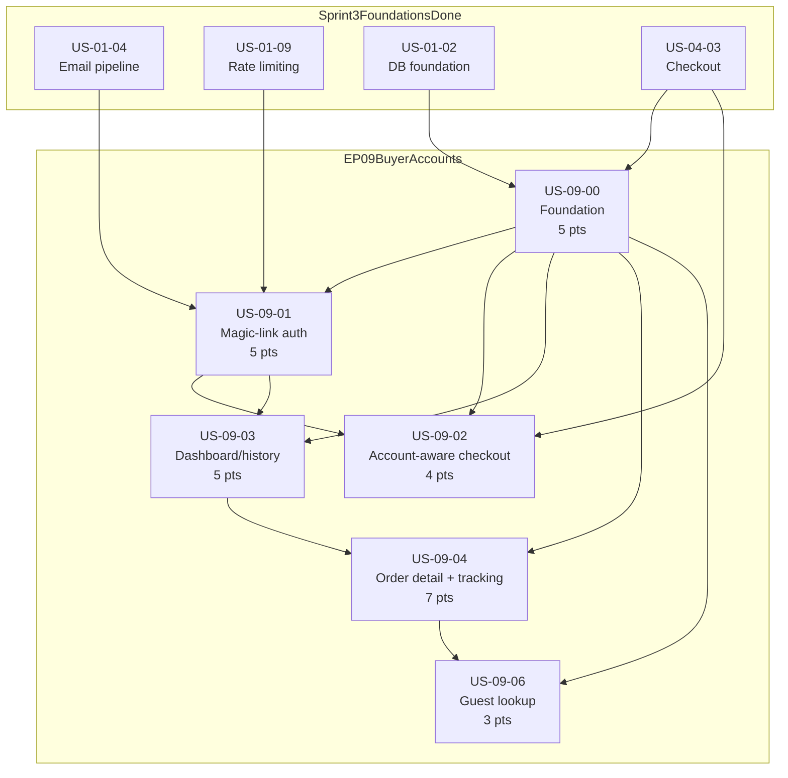

# Sprint 7 — Buyer Accounts, Order Visibility & Tracking MVP

**Sprint:** 7 | **Points:** 29 | **Stories:** 6
**Epic:** EP-09 (Buyer Accounts)
**Audience:** AI coding agents, developers
**Companion documents:**
- Checklist: [`docs/SPRINT_7_CHECKLIST.md`](../SPRINT_7_CHECKLIST.md)
- Progress tracker: [`docs/SPRINT_7_PROGRESS.md`](../SPRINT_7_PROGRESS.md)
- Story documents: [`docs/sprint-7/stories/`](./stories/)
- Planning baseline: [`docs/sprint-7/buyer-accounts-epic-v3.md`](./buyer-accounts-epic-v3.md)
- Cursor execution prompt: [`docs/sprint-7/cursor-agent-prompt.md`](./cursor-agent-prompt.md)
- Cursor kickoff prompt: [`docs/sprint-7/cursor-agent-kickoff-prompt.md`](./cursor-agent-kickoff-prompt.md)

**Current progress:** Planning ready. Implementation not started. Treat [`docs/sprint-7/buyer-accounts-epic-v3.md`](./buyer-accounts-epic-v3.md) as the reconciliation/prep document and this file as the normalized Sprint 7 implementation guide.

---

## How to use these prompts

For Cursor-based implementation, use the Sprint 7 prompts in this order:

1. Start with [`docs/sprint-7/cursor-agent-kickoff-prompt.md`](./cursor-agent-kickoff-prompt.md) in a fresh Cursor session.
2. The kickoff prompt tells the agent to read the Sprint 7 docs, select the next unfinished story in dependency order, and work on exactly one story in that session.
3. The agent should then follow [`docs/sprint-7/cursor-agent-prompt.md`](./cursor-agent-prompt.md) as the strict execution contract for that story.
4. At the end of the story, the agent must:
   - run the relevant tests/checks
   - fix any introduced issues
   - update all required documentation
   - stop the session
5. Start a new Cursor session for the next story and repeat.

Important:

- Do not use one long-running Cursor session for the whole sprint.
- Do not proceed to the next story until the current story’s code, tests, and docs are fully updated.
- If the agent finds ambiguity or a code/doc conflict, it must pause and wait for user clarification before proceeding.

---

## Sprint 7 objective

Turn buyer accounts into a buildable Sprint 7 implementation plan that matches the current Joe Perks repo, PRD, and documentation. Sprint 7 should deliver the minimum buyer-account foundation needed for account access, order history, order detail, guest order lookup, and tracking visibility without overreaching into later extensions like marketing preferences, saved payment methods, or billing portal work.

This sprint extends the existing buyer storefront flow delivered in Sprint 3:

- storefront at `apps/web`
- three-step checkout
- `PaymentElement`
- buyer/order creation during `create-intent`
- Stripe webhook confirmation
- post-purchase confirmation page at `/{locale}/{slug}/order/{pi_id}`

Sprint 7 adds account-aware access patterns on top of that baseline.

---

## Source-of-truth planning inputs

Every Sprint 7 story should stay aligned with these files:

- Reconciliation/prep doc: [`docs/sprint-7/buyer-accounts-epic-v3.md`](./buyer-accounts-epic-v3.md)
- Existing epic draft: [`docs/sprint-7/buyer-accounts-epic`](./buyer-accounts-epic)
- PRD: `docs/joe_perks_prd.docx`
- Engineering rules: [`docs/AGENTS.md`](../AGENTS.md)
- Code conventions: [`docs/CONVENTIONS.md`](../CONVENTIONS.md)
- Schema reference: [`docs/joe_perks_db_schema.md`](../joe_perks_db_schema.md)
- Live schema: `packages/db/prisma/schema.prisma`
- Checkout flow: `apps/web/app/api/checkout/create-intent/route.ts`
- Webhook flow: `apps/web/app/api/webhooks/stripe/route.ts`
- Current buyer confirmation surface: `apps/web/app/[locale]/[slug]/order/[pi_id]/page.tsx`

If implementation reveals a mismatch between these docs and the code, update the relevant docs in the same PR.

---

## Current repo alignment

These realities are already true in the repo and must shape Sprint 7 implementation:

- `Buyer` is currently a minimal model with `email`, `name`, and `orders`.
- Checkout already uses Stripe `PaymentElement`; Sprint 7 should not restate base payment UI as new work.
- Buyer upsert happens in `apps/web/app/api/checkout/create-intent/route.ts`, not in the webhook.
- The current post-purchase buyer surface is order confirmation only; there are no buyer account routes yet.
- `MagicLink` exists, but `MagicLinkPurpose` does not yet include `BUYER_AUTH`.
- Shipping/contact data is collected in checkout UI, but not yet persisted on the live `Order` schema as historical snapshots.

---

## Normalized implementation decisions

These decisions are the Sprint 7 source of truth. Story docs and implementation should follow them unless the product owner explicitly reprioritizes.

### 1. Shipping/contact persistence

- Add immutable shipping/contact snapshot fields directly to `Order`.
- At minimum, persist:
  - `buyerEmail`
  - `shipToName`
  - `shipToAddress1`
  - `shipToAddress2`
  - `shipToCity`
  - `shipToState`
  - `shipToPostalCode`
  - `shipToCountry`
- Capture these fields during checkout order creation.
- Use these snapshots for:
  - buyer order detail/history
  - guest lookup
  - future checkout prefill from prior orders
- Do not rely on mutable buyer-profile data as the source of truth for historical orders.

### 2. Buyer authentication

- Buyer auth uses custom magic-link sign-in on `apps/web`, not Clerk.
- Buyer-auth token TTL is **15 minutes**.
- Buyer-auth is distinct from roaster fulfillment magic links and should not reuse the 72-hour fulfillment TTL.
- Session cookies must be:
  - `HttpOnly`
  - `Secure` in production
  - `SameSite=Lax`
- Redirect params must be preserved through sign-in and token redemption.

### 3. Route structure

Buyer account routes must be locale-aware and live under `apps/web/app/[locale]/...`.

Planned route surface:

- `/{locale}/account/sign-in`
- `/{locale}/account/auth/[token]`
- `/{locale}/account`
- `/{locale}/account/orders/[id]`
- `/{locale}/order-lookup`
- supporting API routes under `apps/web/app/api/...`

### 4. Guest order lookup

- Guest lookup should use a persisted `Order.buyerEmail` snapshot plus `Order.orderNumber`.
- Add an index that supports case-insensitive lookup strategy.
- Do not make guest lookup depend on a join through `Buyer` for the primary path.

### 5. Tracking MVP scope

- Tracking MVP uses direct carrier links only.
- Do not include embedded tracking widgets, external iframes, or live carrier API integrations in Sprint 7.
- Buyer account order detail and guest order lookup can share the same direct-link tracking model.

### 6. Marketing and preferences scope

Defer these items out of Sprint 7:

- newsletter preferences center
- unsubscribe flow
- marketing email categories in `sendEmail()`
- Stripe saved payment methods
- buyer billing portal
- reorder
- self-service cancellation
- account deletion

### 7. Newsletter default rule for later work

When marketing preferences are eventually added, the correct default is:

- `newsletter_opt_in = false`
- unchecked by default in UI
- transactional order communication remains separate from marketing consent

### 8. UX / accessibility / Apple HIG-aligned rules

These are mandatory Sprint 7 quality requirements, not polish:

- Keep account creation optional and non-blocking during checkout.
- Explain the value of signing in clearly on auth surfaces.
- Use one clear primary action per auth and tracking screen.
- Use proper mobile input behavior:
  - `type="email"`
  - `inputMode="email"`
  - `autoCapitalize="none"`
  - `autoCorrect="off"`
- Maintain minimum 44x44px touch targets.
- Support keyboard-only navigation.
- Add visible focus states.
- Use `aria-invalid`, `aria-describedby`, and `role="alert"` where appropriate.
- Move focus intentionally after async actions:
  - request sent
  - invalid token
  - lookup error
  - signed-out state
- Respect `prefers-reduced-motion` for all new account, tracking, and loading states.
- Avoid spinner-only states without explanatory copy.
- Preserve state across auth redirects and back navigation.

---

## Deferred from Sprint 7

These features remain valid future buyer-account extensions but are intentionally not part of this sprint:

| Story area | Deferred item | Reason |
|------------|---------------|--------|
| Preferences | Newsletter opt-in/out center | Not required for account foundation |
| Billing | Saved cards + Stripe Customer Portal | Depends on buyer identity and Stripe customer persistence |
| Commerce | Reorder | Better after account and order-detail foundations land |
| Commerce | Self-service cancellation | Adds refund/business-policy complexity |
| Profile | Buyer profile editing and account deletion | Separate compliance/data-retention scope |
| Tracking | Embedded carrier widgets and live ETA | Exceeds direct-link MVP |

---

## Epic and stories

### EP-09 — Buyer Accounts (29 pts)

| Story ID | Title | Pts | Priority | Dependencies | App/Package |
|----------|-------|-----|----------|--------------|-------------|
| US-09-00 | Buyer account foundation: schema, shipping snapshots, auth/env prep | 5 | High | US-01-02, US-04-03 | `packages/db`, `apps/web` |
| US-09-01 | Buyer magic-link auth and session flow | 5 | High | US-09-00, US-01-04, US-01-09 | `apps/web`, `packages/email` |
| US-09-02 | Account-aware checkout and post-purchase create-account prompt | 4 | High | US-09-00, US-09-01, US-04-03 | `apps/web` |
| US-09-03 | Buyer account dashboard and order history | 5 | High | US-09-01, US-09-00 | `apps/web` |
| US-09-04 | Buyer order detail and tracking MVP | 7 | High | US-09-03, US-09-00 | `apps/web` |
| US-09-06 | Guest order lookup with direct-link tracking | 3 | High | US-09-00, US-09-04 | `apps/web` |

**Story implementation status:** All Sprint 7 stories start at **`Todo`**. Use [`docs/SPRINT_7_PROGRESS.md`](../SPRINT_7_PROGRESS.md) as the live tracker.

---

## Dependency graph

---

## Recommended implementation order

| Phase | Story | Rationale |
|-------|-------|-----------|
| 1 | US-09-00 | Unblocks every other story by normalizing schema, shipping snapshots, guest lookup model, and env/session prep |
| 2 | US-09-01 | First true buyer-account capability; creates reusable auth/session foundations |
| 3 | US-09-02 | Connects auth value to existing checkout/confirmation flow without blocking purchase |
| 4 | US-09-03 | Introduces authenticated buyer order visibility after session exists |
| 5 | US-09-04 | Adds buyer order detail and tracking on top of real account/history data |
| 6 | US-09-06 | Guest lookup can reuse the tracking/detail model and shipping/email snapshots |

Parallelization opportunities are limited early because Sprint 7 is foundation-heavy. The safest overlap is small UI preparation for US-09-02 while US-09-01 is stabilizing, but schema/session decisions from US-09-00 must land first.

---

## Story-to-file mapping

| Story | Primary files to create or modify |
|-------|----------------------------------|
| US-09-00 | `packages/db/prisma/schema.prisma`, migrations, `.env.example`, `apps/web/app/api/checkout/create-intent/route.ts`, supporting auth/session utilities |
| US-09-01 | `apps/web/app/[locale]/account/sign-in/page.tsx`, `apps/web/app/[locale]/account/auth/[token]/page.tsx`, `apps/web/app/api/account/session/route.ts`, buyer-session helpers, buyer auth email template |
| US-09-02 | `apps/web/app/[locale]/[slug]/checkout/_components/step-shipping.tsx`, `step-payment-wrapper.tsx`, `order/[pi_id]/page.tsx`, confirmation components, possible prefill/session helpers |
| US-09-03 | `apps/web/app/[locale]/account/page.tsx`, related `_components/`, `_lib/` queries/helpers |
| US-09-04 | `apps/web/app/[locale]/account/orders/[id]/page.tsx`, reusable tracking/detail components, carrier-link helpers |
| US-09-06 | `apps/web/app/[locale]/order-lookup/page.tsx`, `apps/web/app/api/order-lookup/route.ts`, shared tracking/detail read model |

---

## Diagram references

These diagrams remain the source of truth for Sprint 7 architecture and should be updated in the same PR if implementation changes them.

| Diagram | Path | Sprint 7 relevance |
|---------|------|--------------------|
| Project Structure | [`docs/01-project-structure.mermaid`](../01-project-structure.mermaid) | Route and file layout reference for new buyer account pages |
| Order Lifecycle | [`docs/04-order-lifecycle.mermaid`](../04-order-lifecycle.mermaid) | Buyer post-checkout and tracking touchpoints; must be updated to match buyer upsert timing and any new account flows |
| Database Schema | [`docs/06-database-schema.mermaid`](../06-database-schema.mermaid) | `Buyer`, `Order`, `MagicLink`, `OrderEvent`, `EmailLog` |
| Stripe Payment Flow | [`docs/07-stripe-payment-flow.mermaid`](../07-stripe-payment-flow.mermaid) | Context only; Sprint 7 should not expand into saved cards or billing portal |
| Order State Machine | [`docs/08-order-state-machine.mermaid`](../08-order-state-machine.mermaid) | Buyer order-detail/tracking state presentation |

---

## Document references

| Document | Path | Sprint 7 relevance |
|----------|------|--------------------|
| Buyer Accounts Prep | [`docs/sprint-7/buyer-accounts-epic-v3.md`](./buyer-accounts-epic-v3.md) | Reconciliation baseline and normalized decisions |
| AGENTS.md | [`docs/AGENTS.md`](../AGENTS.md) | Buyer upsert, magic link rules, sendEmail rules, auth model, Stripe rules, PII guidance |
| CONVENTIONS.md | [`docs/CONVENTIONS.md`](../CONVENTIONS.md) | App Router patterns, route layout, money handling, API conventions |
| DB Schema Reference | [`docs/joe_perks_db_schema.md`](../joe_perks_db_schema.md) | Current schema and explicit note that shipping snapshot columns are not in MVP today |
| Storefront E2E Plan | [`docs/sprint-6/STOREFRONT_E2E_TEST_PLAN.md`](../sprint-6/STOREFRONT_E2E_TEST_PLAN.md) | Baseline buyer flow and current PaymentElement behavior |

---

## Key AGENTS.md and CONVENTIONS.md rules for Sprint 7

1. **Money as cents** — All prices, totals, and impact values remain `Int` cents.
2. **Split calculations** — Use frozen order values; do not recalculate historical order amounts in buyer account UI.
3. **Magic links** — Buyer auth is a new magic-link purpose, but still must follow single-use validation and secure token handling.
4. **sendEmail()** — Use `sendEmail()` for buyer-auth and transactional sends. Do not import Resend directly in apps.
5. **Stripe** — Do not add buyer Stripe-customer work to Sprint 7 unless explicitly reprioritized.
6. **Logging and PII** — Never log buyer addresses, raw emails in sensitive contexts, or request bodies from checkout/webhooks.
7. **Apps/web route structure** — Buyer account pages must fit the locale-scoped app layout and public-storefront route conventions.

---

## Cross-story UX / QA requirements

These apply to every Sprint 7 story:

- Locale-aware routes and redirects
- 44x44px minimum touch targets
- keyboard accessibility and visible focus
- reduced-motion support
- screen-reader-friendly form validation and status messaging
- deliberate focus management after auth, lookup, and error states
- state preservation through auth redirects and back navigation
- mobile-first layouts for auth, dashboard, detail, and lookup pages
- no purchase-blocking account requirements

These requirements are mandatory acceptance criteria, not optional polish.

---

## Success criteria for Sprint 7

Sprint 7 is successful when:

- a buyer can request and redeem a sign-in link securely
- account routes are locale-aware and session-protected
- shipping/contact snapshots exist on `Order`
- buyer order history and order detail pages work from real persisted data
- guest order lookup works without requiring an account
- tracking MVP gives clear order-state visibility and direct carrier-link access
- implementation and docs remain aligned with the codebase and diagrams

---

## Revision log

| Version | Date | Notes |
|---------|------|-------|
| 0.1 | 2026-04-05 | Initial normalized Sprint 7 implementation guide created from the buyer-accounts reconciliation document and repo conventions. |
