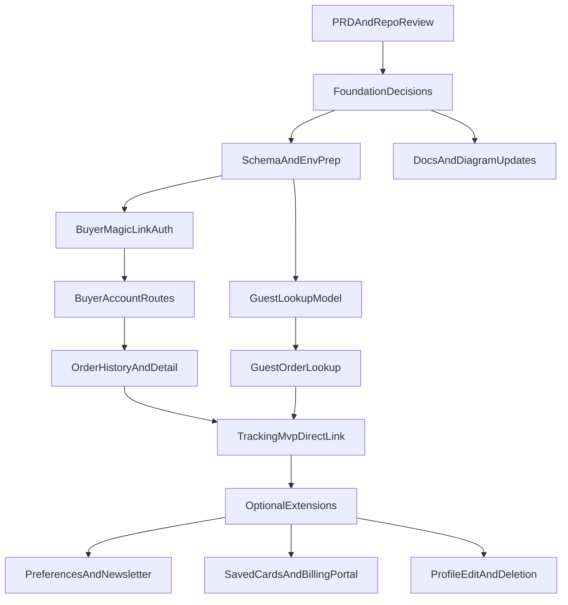

## Buyer Accounts Epic v3

Implementation prep document for Sprint 7.

This document reconciles the buyer-accounts concept against the current Joe Perks PRD, live codebase, repository documentation, and mermaid diagrams. It is intentionally implementation-first: it identifies what already exists, what does not exist, where the current `docs/sprint-7/buyer-accounts-epic` overstates readiness, and what must be updated before buyer-account feature work begins.

## Source Of Truth

- Product baseline: `docs/joe_perks_prd.docx`
- Current epic draft: `docs/sprint-7/buyer-accounts-epic`
- Engineering rules: `docs/AGENTS.md`
- Code conventions: `docs/CONVENTIONS.md`
- Schema reference: `docs/joe_perks_db_schema.md`
- Live schema: `packages/db/prisma/schema.prisma`
- Checkout flow: `apps/web/app/api/checkout/create-intent/route.ts`
- Stripe webhook flow: `apps/web/app/api/webhooks/stripe/route.ts`
- Current buyer confirmation UI: `apps/web/app/[locale]/[slug]/order/[pi_id]/page.tsx`
- Current checkout UI: `apps/web/app/[locale]/[slug]/checkout/_components/checkout-form.tsx`
- Current shipping form: `apps/web/app/[locale]/[slug]/checkout/_components/step-shipping.tsx`
- Current payment step: `apps/web/app/[locale]/[slug]/checkout/_components/step-payment-wrapper.tsx`
- Current order confirmation components:
  - `apps/web/app/[locale]/[slug]/order/[pi_id]/_components/order-summary.tsx`
  - `apps/web/app/[locale]/[slug]/order/[pi_id]/_components/order-status-poller.tsx`
- Relevant diagrams:
  - `docs/01-project-structure.mermaid`
  - `docs/04-order-lifecycle.mermaid`
  - `docs/06-database-schema.mermaid`
  - `docs/07-stripe-payment-flow.mermaid`

## Executive Summary

The PRD supports buyer-facing outcomes such as fast mobile checkout, post-purchase confirmation, shipment notification, delay notification, and fundraiser impact visibility. It does not define a full buyer portal, buyer authentication layer, buyer preferences center, or self-service payment-method management.

The current repository implements guest-first buyer commerce:

- `Buyer` exists as a minimal record keyed by email.
- Checkout already uses Stripe `PaymentElement`.
- Checkout creates a `Buyer` and `Order` before payment confirmation.
- The Stripe webhook confirms the order and sends the buyer order-confirmation email.
- The current buyer-facing post-purchase page is `/{locale}/{slug}/order/{pi_id}`.

Buyer accounts do not currently exist as a product surface in the codebase. There are no buyer session helpers, no `/account/*` routes, no `/api/account/*` routes, no guest `/order-lookup` route, no buyer-auth magic links, no buyer preference models, and no saved-payment support persisted on `Buyer`.

Accordingly, EP-09 v3 should not be treated as a near-ready implementation backlog. It should be treated as a preparation and alignment document that closes foundational gaps first.

## PRD Alignment

From `docs/joe_perks_prd.docx`, the buyer persona and MVP flows align with:

- fast, mobile-friendly checkout
- buyer confidence through confirmation and tracking communication
- fundraiser impact visibility
- transactional email communication tied to order progress

The PRD also reinforces several constraints already reflected elsewhere in the repo:

- buyer storefront lives on `apps/web`
- checkout stays on-site with Stripe Elements
- magic links already exist in the platform, but the documented MVP use is roaster fulfillment, not buyer login
- rate limiting, PII protection, and webhook verification matter

The PRD does not establish the following as implemented or required MVP capabilities:

- buyer sign-in or persistent buyer sessions
- buyer order dashboard
- guest order lookup page
- marketing preferences center
- Stripe Customer Portal for buyers
- reorder and self-service cancellation
- buyer profile editing or account deletion

These can still be valid product extensions, but v3 must mark them as new feature scope rather than implied current capability.

## Current-State Audit

### 1. Buyer Data Model

Current live schema in `packages/db/prisma/schema.prisma`:

```typescript
model Buyer {
  id    String  @id @default(cuid())
  email String  @unique
  name  String?

  createdAt DateTime @default(now())
  updatedAt DateTime @updatedAt

  orders Order[]
}
```

Current `Buyer` supports only:

- unique email
- optional display name
- relation to `Order`

Missing for buyer accounts:

- `stripe_customer_id`
- `last_sign_in_at`
- `newsletter_opt_in`
- consent timestamps/versioning
- deletion/anonymization fields
- granular preference rows

### 2. Checkout And Order Creation

The current checkout API in `apps/web/app/api/checkout/create-intent/route.ts` already creates the buyer and order before payment succeeds:

```typescript
const buyer = await tx.buyer.upsert({
  where: { email: body.buyerEmail },
  create: { email: body.buyerEmail, name: body.buyerName },
  update: {},
});
```

Key realities:

- buyer creation is email-based upsert only
- checkout request body includes `buyerEmail` and `buyerName`
- the current API does not accept buyer-session context
- the current API does not accept newsletter or buyer-account flags
- the current API does not persist shipping-address columns on `Order`

### 3. Shipping Address Collection Versus Persistence

The shipping form in `apps/web/app/[locale]/[slug]/checkout/_components/step-shipping.tsx` collects:

- name
- email
- street
- city
- state
- zip
- shipping rate

The shipping form schema in `apps/web/app/[locale]/[slug]/checkout/_lib/schema.ts` validates those fields, but the current `Order` schema does not include shipping-address columns, and `docs/joe_perks_db_schema.md` explicitly says the MVP schema does not yet embed shipping-address fields on `Order`.

This was verified directly in the live `packages/db/prisma/schema.prisma` file. For Sprint 7 planning purposes, shipping-address persistence should be treated as missing infrastructure, not assumed infrastructure.

This is a major prerequisite gap for buyer accounts because several ideas in EP-09 v2 depend on:

- pre-filling shipping from past orders
- showing historical shipping details in buyer account pages
- reusing last delivered address

Those behaviors cannot be implemented cleanly until the persistence model for shipping/contact data is defined.

### 4. Payments Surface

`PaymentElement` is already in use today. See:

- `apps/web/app/[locale]/[slug]/checkout/_components/step-payment-wrapper.tsx`
- `docs/CONVENTIONS.md`
- `docs/sprint-6/STOREFRONT_E2E_TEST_PLAN.md`

This means v3 should distinguish between:

- already-implemented payment collection UI
- not-yet-implemented buyer saved-payment features

What exists:

- Stripe `PaymentElement`
- create-intent flow
- order confirmation redirect

What does not exist:

- buyer `stripe_customer_id`
- saved cards for signed-in buyers
- buyer billing-portal route
- buyer payment-method management UX

### 5. Buyer Confirmation Surface

The current buyer-facing post-purchase page is `apps/web/app/[locale]/[slug]/order/[pi_id]/page.tsx`.

What it currently does:

- loads the order by `stripePiId`
- renders a pending-state poller when the order is still `PENDING`
- renders a simple order-summary card once confirmed
- shows fundraiser impact on the confirmation page

What it does not do:

- buyer authentication
- multi-order history
- order detail dashboard
- tracking stepper
- shipment carrier link
- delay state UI
- saved-account prompt

### 6. Transactional Email Infrastructure

`packages/email/send-email.ts` currently provides:

- Resend-based delivery
- `EmailLog` dedupe on `(entityType, entityId, template)`
- retry-safe cleanup on failed sends

What it does not currently provide:

- marketing vs transactional categories
- newsletter suppression logic
- unsubscribe headers
- buyer preference enforcement

The current buyer order-confirmation email is sent from `apps/web/app/api/webhooks/stripe/route.ts` after the order becomes `CONFIRMED`.

### 7. Auth And Route Surface

Current docs still describe buyer storefront access as public:

- `docs/AGENTS.md` auth table: `apps/web` buyer storefront -> public
- `docs/01-project-structure.mermaid` lists storefront, checkout, and order confirmation routes, but no buyer-account routes
- `docs/CONVENTIONS.md` route structure for `apps/web` includes checkout and order confirmation only

There are currently no buyer-account routes in `apps/web`:

- no `/account`
- no `/account/sign-in`
- no `/account/orders/[id]`
- no `/account/preferences`
- no `/api/account/session`
- no `/api/account/billing-portal`
- no `/order-lookup`

### 8. Magic-Link Infrastructure

`MagicLink` already exists in the live schema, but `MagicLinkPurpose` currently contains:

- `ORDER_FULFILLMENT`
- `ORG_APPROVAL`
- `ROASTER_REVIEW`

Missing:

- `BUYER_AUTH`
- any buyer-account redemption flow
- any buyer session-cookie logic

This means the statement in EP-09 v2 that buyer auth can simply reuse an already-present buyer session pattern is inaccurate. The platform has magic-link infrastructure, but not buyer-auth infrastructure.

## Documentation And Diagram Drift

The v3 document must also correct repository documentation drift that affects buyer-account planning.

### Confirmed Drift Items

1. `docs/04-order-lifecycle.mermaid` is ahead of or different from current implementation in several places.
   - It shows buyer upsert during webhook processing, but the live code upserts `Buyer` during `create-intent`.
   - It shows order-number assignment during webhook processing, but the live code generates `orderNumber` during `create-intent`.
   - It references shipping-address behavior not represented in the current live schema.

2. `docs/06-database-schema.mermaid` and `docs/joe_perks_db_schema.md` align with the minimal `Buyer` model, which conflicts with assumptions in EP-09 v2 that buyer-account fields already nearly exist.

3. `docs/01-project-structure.mermaid` and `docs/CONVENTIONS.md` accurately describe the current buyer surface as storefront, checkout, and order confirmation only. That directly contradicts any assumption that buyer account routes are already scaffolded.

4. `docs/AGENTS.md` still correctly reflects current implementation for buyers, but it will become outdated once buyer sessions are introduced.

## Gap Matrix

| Area | PRD support | Current repo state | Gap status | Required pre-implementation action |
| --- | --- | --- | --- | --- |
| Buyer identity | Buyer exists conceptually as a purchaser | `Buyer` is minimal email/name model | Partial | Extend schema only after route and session model are defined |
| Buyer auth | Not defined as MVP in PRD | No buyer auth/session exists | Missing | Decide buyer auth pattern and cookie/session contract |
| Buyer magic link | PRD supports magic links in platform, but not buyer login | No `BUYER_AUTH` purpose | Missing | Add enum value, token flow, email template, and redemption route |
| Buyer dashboard | Not defined in PRD MVP | No `/account` routes | Missing | Define route tree, auth guard, data queries, and empty states |
| Guest order lookup | Supports buyer visibility goal, but not explicitly specified in PRD MVP | No route or API | Missing | Decide lookup model and rate limiting path |
| Order tracking UI | PRD supports order-status communication | Current UI is confirmation summary only | Partial | Decide MVP tracking surface: direct link vs richer status stepper |
| Shipping-address reuse | Fits buyer convenience goals | Current address fields collected but not persisted on `Order` schema | Missing | Define canonical storage model before any prefill or profile work |
| Newsletter/preferences | Not required by PRD | No category-aware send logic or preference model | Missing | Confirm whether this is Phase 1, later phase, or separate epic |
| Saved payment methods | Not required by PRD | `PaymentElement` exists, but no buyer Stripe customer persistence | Missing | Add schema + Stripe customer strategy only if in scope |
| Billing portal | Not required by PRD | No buyer billing portal route | Missing | Treat as later buyer-payments extension, not foundation |
| Profile/account deletion | Not required by PRD | No profile route, no deletion fields/process | Missing | Define compliance and data-retention model first |

## Major Corrections To EP-09 v2

The existing `docs/sprint-7/buyer-accounts-epic` should not be used as-is for implementation planning. These corrections must be carried into v3.

### 1. Buyer auth is not already present

EP-09 v2 treats buyer magic-link auth as if the missing work is mostly a thin UI layer. That is incorrect. The repo has generic magic-link infrastructure, but it does not have:

- buyer auth purpose
- buyer auth routes
- buyer auth email template
- buyer session signing
- buyer session middleware/helpers
- buyer sign-out path

### 2. `buyer_email` lookup is not modeled today

EP-09 v2 proposes guest lookup via `Order.buyer_email` and an index on that column. The current schema does not have `buyer_email` on `Order`; it links `Order` to `Buyer` through `buyerId`.

This must be a deliberate design decision:

- option A: add denormalized `buyerEmail` to `Order`
- option B: keep lookup join-based through `Buyer`

The repo should not assume one approach without explicitly choosing it.

### 3. Shipping-address-dependent stories are blocked by missing persistence

Any story involving:

- prefilled checkout
- historical shipping display
- account profile shipping defaults
- reorder based on last address

depends on defining where shipping/contact data is stored and how it is accessed historically.

### 4. PaymentElement is already done

EP-09 v2 presents some payment work as if the platform still needs a base Stripe Elements migration. That is no longer true. The repo already uses `PaymentElement`. Future work should focus only on account-aware payment capabilities, not the base payment UI.

### 5. Newsletter defaults are internally inconsistent

EP-09 v2 mixes multiple incompatible assumptions:

- `newsletter_opt_in` defaulting to `true`
- checkout newsletter checkbox being unchecked by default
- an order-updates opt-in concept mixed together with newsletter/marketing preferences

V3 should separate these concepts:

- transactional order communication
- optional marketing/newsletter consent
- any future granular preference center

Recommended correction:

- `newsletter_opt_in` should default to `false` in the schema
- the marketing/newsletter checkbox should be unchecked by default
- transactional order updates should not share the same consent flag as marketing

### 6. Tracking scope must match MVP reality

EP-09 v2 alternates between:

- direct carrier-link MVP
- embedded carrier widget/iframe
- estimated delivery logic
- richer visual tracking timeline

The PRD supports buyer visibility and notifications but leaves delivery-confirmation mechanics open. V3 should therefore frame tracking as a product decision set, not as already-set implementation facts.

### 7. Several v2 stories are extension work, not foundation work

These may still be valid later-scope buyer-account stories, but they should not block foundational implementation planning:

- buyer billing portal
- saved payment methods
- reorder
- self-service cancellation
- profile editing
- account deletion
- marketing preference center

## Required Product And Architecture Decisions

These decisions should be made before implementation tickets are finalized.

### Decision 1. Buyer-auth token TTL

There is a mismatch between:

- existing platform guidance around magic links
- PRD wording around magic-link expectations
- EP-09 v2 proposal of 15-minute buyer-auth tokens

Recommended decision:

- buyer-auth magic links use a 15-minute TTL
- roaster-fulfillment and buyer-auth links should be treated as separate flows with separate expiry expectations
- code comments and docs should call this out explicitly so agents do not copy the 72-hour fulfillment pattern into buyer auth

### Decision 2. Guest lookup data model

Recommended decision:

- add `Order.buyerEmail` for direct case-insensitive guest lookup
- add an index for the lookup path
- avoid a join-through-`Buyer` query for the primary guest-lookup path, since it adds complexity without clear buyer-facing value

### Decision 3. Shipping/contact persistence model

Before any buyer profile or order-history work:

- decide whether shipping fields live on `Order`
- decide whether last-used address is derived from prior orders or stored separately
- define what buyer-facing pages may display historically

Current planning assumption:

- shipping/contact persistence is not yet present in the live schema and must be added deliberately
- no buyer story should assume prefill or historical shipping display until that persistence work lands

### Decision 4. Marketing scope in this epic

Recommended decision:

- Sprint 7 should focus on buyer auth, buyer access, order visibility, and tracking
- marketing/newsletter preferences should be deferred to a later phase
- unsubscribe and preference-center work should not block the buyer-account foundation

### Decision 5. Tracking MVP definition

Recommended decision:

- tracking MVP should use direct carrier-link behavior only
- embedded widgets, richer estimated-delivery logic, and more elaborate tracking visualizations should be treated as later-scope enhancements
- buyer dashboard and guest lookup can share the same basic direct-link tracking model once the account foundations exist

## Recommended Implementation Phases

### Phase 0. Foundation Alignment

Purpose: align docs and choose architecture before feature coding.

- update the buyer-accounts planning doc itself
- resolve the five decisions above
- identify which repository docs must change when buyer auth ships:
  - `docs/AGENTS.md`
  - `docs/CONVENTIONS.md`
  - `docs/01-project-structure.mermaid`
  - `docs/04-order-lifecycle.mermaid`

### Phase 1. Data Model And Session Foundations

Purpose: create the minimum backend needed for buyer accounts.

Recommended scope:

- add buyer-auth support to `MagicLinkPurpose`
- add buyer-session env contract such as `SESSION_SECRET`
- add only the minimum new buyer fields needed for auth and account access
- decide and implement shipping/contact persistence model
- add any required order lookup fields or indexes

Output of this phase:

- schema ready
- env contract ready
- buyer auth primitives ready

### Phase 2. Buyer Access Surface

Purpose: let a buyer access their own orders safely.

Recommended scope:

- `/account/sign-in`
- `/account/auth/[token]`
- session helper and sign-out flow
- `/account`
- `/account/orders/[id]`
- unauthenticated redirect handling

This is the first phase that truly creates buyer accounts in the product.

### Phase 3. Buyer Tracking And Lookup

Purpose: improve order visibility without overreaching.

Recommended scope:

- `/order-lookup`
- buyer order list
- buyer order detail
- direct carrier-link MVP
- delay messaging consistent with current SLA model

This phase should build on the current order-confirmation experience rather than replace it blindly.

For Sprint 7, do not expand this phase to include embedded carrier widgets or advanced estimated-delivery calculations.

### Phase 4. Optional Buyer-Account Extensions

Purpose: ship higher-complexity features only after the foundation is working.

Potential later-scope items:

- newsletter/preferences center
- unsubscribe flow and marketing email categories
- saved payment methods
- Stripe billing portal
- reorder
- self-service cancellation
- buyer profile editing
- account deletion/anonymization

## Buyer Accounts Preparation Flow



## Pre-Implementation Checklist

### Repo And Schema

- define buyer-account schema delta before story splitting
- define whether guest lookup needs `Order` denormalization
- define shipping/contact storage model
- define buyer-session env vars and cookie strategy

### Auth And Routes

- add buyer-auth magic-link purpose and flow
- add buyer-account routes under `apps/web`
- define route guards and redirect strategy
- define sign-out behavior

### Email

- add buyer-auth magic-link template if buyer auth is approved
- decide whether marketing email categories are in scope now
- if yes, extend `sendEmail()` with category handling and unsubscribe support

### Docs

- update `docs/AGENTS.md` auth model after implementation
- update `docs/CONVENTIONS.md` route structure
- update `docs/01-project-structure.mermaid` with buyer-account routes
- update `docs/04-order-lifecycle.mermaid` to match live order creation timing and any new buyer-account touchpoints

### Testing

- add auth-flow tests for buyer magic-link request/redeem/sign-out
- add route protection tests for buyer account pages
- add lookup tests for guest order lookup
- add tracking tests for confirmed/shipped/delivered/refunded states
- update storefront E2E test plans after route surface changes

## Recommended v3 Positioning

Use buyer-accounts work as a staged extension of the existing buyer commerce flow, not as a single all-at-once epic.

The implementation order should be:

1. align docs and make missing architecture decisions
2. add schema and session foundations
3. add buyer access and order visibility
4. add tracking improvements
5. add optional payment-method and preference extensions only if still in scope

That sequence keeps the buyer-accounts initiative aligned with:

- the PRD's actual buyer needs
- the current guest-first implementation
- the live schema and route surface
- the repository documentation and mermaid diagrams
