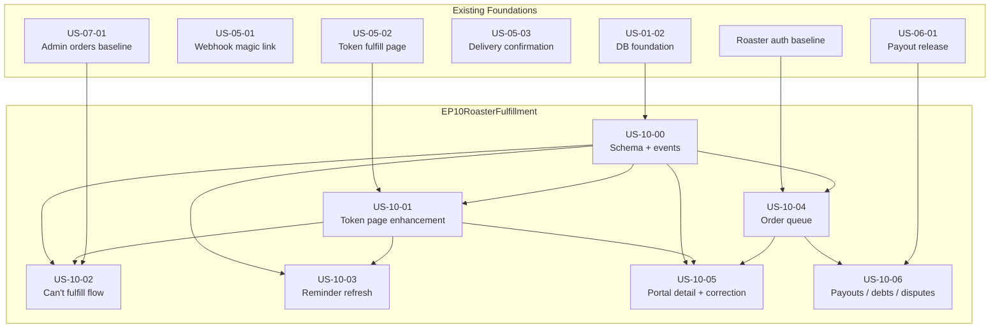

# Sprint 8 — Roaster Fulfillment Enhancement

**Sprint:** 8-9 | **Stories:** 7
**Epic:** EP-10 (Roaster Fulfillment)
**Audience:** AI coding agents, developers

**Companion documents:**
- Checklist: [`docs/SPRINT_8_CHECKLIST.md`](../SPRINT_8_CHECKLIST.md)
- Progress tracker: [`docs/SPRINT_8_PROGRESS.md`](../SPRINT_8_PROGRESS.md)
- Story documents: [`docs/sprint-8/stories/`](./stories/)
- Planning baseline: [`docs/sprint-8/roaster-fulfillment-epic-v4.md`](./roaster-fulfillment-epic-v4.md)
- Pre-flight decisions: [`docs/sprint-8/roaster-fulfillment-preflight-decisions.md`](./roaster-fulfillment-preflight-decisions.md)
- Cursor execution prompt: [`docs/sprint-8/cursor-agent-prompt.md`](./cursor-agent-prompt.md)
- Cursor kickoff prompt: [`docs/sprint-8/cursor-agent-kickoff-prompt.md`](./cursor-agent-kickoff-prompt.md)

**Current progress:** Sprint 8 planning is complete. `US-10-00` through `US-10-06` are documented and ready for implementation, but none should be treated as started until the code, tests, and sprint trackers are updated in the same PR.

---

## How to use these prompts

For Cursor-based implementation, use the Sprint 8 prompts in this order:

1. Start with [`docs/sprint-8/cursor-agent-kickoff-prompt.md`](./cursor-agent-kickoff-prompt.md) in a fresh Cursor session.
2. The kickoff prompt tells the agent to read the Sprint 8 docs, select the next unfinished story in dependency order, and work on exactly one story in that session.
3. The agent should then follow [`docs/sprint-8/cursor-agent-prompt.md`](./cursor-agent-prompt.md) as the strict execution contract for that story.
4. At the end of the story, the agent must:
   - run the relevant tests/checks
   - fix any introduced issues
   - update all required documentation
   - stop the session
5. Start a new Cursor session for the next story and repeat.

Important:

- Do not use one long-running Cursor session for the whole sprint.
- Do not proceed to the next story until the current story’s code, tests, and docs are fully updated.
- If the agent finds ambiguity or a code/doc conflict, it must pause and wait for user clarification before proceeding.

---

## Sprint 8 objective

Turn the existing roaster fulfillment MVP into a buildable Sprint 8-9 implementation plan that matches the Joe Perks repo, PRD, and documentation. Sprint 8 should extend the live email-first fulfillment path with a stronger token-page UX, structured issue reporting, reminder/escalation cleanup, and the first real authenticated roaster operations surfaces.

This sprint extends the fulfillment baseline already delivered in Sprint 4:

- webhook-side roaster fulfillment magic-link creation
- roaster token fulfillment page at `/fulfill/[token]`
- tracking submission and buyer shipped email
- admin delivery confirmation
- SLA warning / breach / critical / auto-refund job
- payout release job

Sprint 8 adds roaster-facing operational completeness on top of that baseline.

---

## Source-of-truth planning inputs

Every Sprint 8 story should stay aligned with these files:

- Final epic baseline: [`docs/sprint-8/roaster-fulfillment-epic-v4.md`](./roaster-fulfillment-epic-v4.md)
- Pre-flight decisions: [`docs/sprint-8/roaster-fulfillment-preflight-decisions.md`](./roaster-fulfillment-preflight-decisions.md)
- Original product draft: [`docs/sprint-8/roaster-fulfillmet`](./roaster-fulfillmet)
- PRD: `docs/joe_perks_prd.docx`
- Engineering rules: [`docs/AGENTS.md`](../AGENTS.md)
- Code conventions: [`docs/CONVENTIONS.md`](../CONVENTIONS.md)
- Schema reference: [`docs/joe_perks_db_schema.md`](../joe_perks_db_schema.md)
- Live schema: `packages/db/prisma/schema.prisma`
- Webhook flow: `apps/web/app/api/webhooks/stripe/route.ts`
- Token fulfillment flow: `apps/roaster/app/fulfill/[token]/`
- SLA job: `apps/web/lib/inngest/run-sla-check.tsx`
- Payout job: `apps/web/lib/inngest/run-payout-release.ts`

If implementation reveals a mismatch between these docs and the code, update the relevant docs in the same PR.

---

## Current repo alignment

These realities are already true in the repo and must shape Sprint 8:

- The repo already has a working roaster magic-link fulfillment flow.
- The repo already enforces one live `ORDER_FULFILLMENT` link per order through `MagicLink.dedupeKey`.
- The current token page is functional but minimal.
- The current roaster dashboard and payouts routes are still placeholders.
- The SLA job already exists and should be extended, not replaced.
- The payout release job already exists and should be surfaced, not redesigned.
- Live event names and payout states must be used as implemented, not as imagined in earlier drafts.

---

## Normalized implementation decisions

These decisions are the Sprint 8 source of truth. Story docs and implementation should follow them unless the product owner explicitly reprioritizes.

### 1. Fulfillment-link model

- Keep one live `ORDER_FULFILLMENT` link row per order.
- Reuse the active token for normal reminder tiers while it remains valid.
- Rotate the same `MagicLink` row in place only when the token is expired or explicitly regenerated.

### 2. Expired-link recovery

- Recovery must be token-based, not free-form public order lookup.
- Regeneration is allowed only when the token row exists, is expired, unused, and still points to a `CONFIRMED` order.

### 3. Flagged-order behavior

- `ORDER_FLAGGED` pauses automated fulfillment-side SLA handling.
- Unresolved flags pause roaster reminder/urgent sends, buyer delay emails, and auto-refund.
- Admin acknowledgement alone does not resume the timer.
- Explicit admin resolution writes `FLAG_RESOLVED`.

### 4. Portal mutation pattern

- Authenticated roaster portal mutations use server actions by default.
- Portal writes must scope through `requireRoasterId()`.

### 5. Tracking correction scope

- Tracking correction is in scope.
- It is portal-only.
- It writes `TRACKING_UPDATED`.

### 6. Fulfillment note scope

- `fulfillmentNote` is in scope.
- It should be optional and available in both token and portal fulfillment flows.

### 7. Payout vocabulary

- Use live states:
  - `HELD`
  - `TRANSFERRED`
  - `FAILED`
- Derive UI labels from live state plus `payoutEligibleAt`.

### 8. Event naming

Use live or explicitly added event names only:

- `PAYMENT_SUCCEEDED`
- `FULFILLMENT_VIEWED`
- `SHIPPED`
- `TRACKING_UPDATED`
- `DELIVERED`
- `ORDER_FLAGGED`
- `FLAG_RESOLVED`
- `MAGIC_LINK_RESENT`

---

## Deferred from Sprint 8

These features remain valid future extensions but are intentionally not part of this sprint:

| Area | Deferred item | Reason |
|------|---------------|--------|
| Shipping | EasyPost label generation | Requires later schema and integration work |
| Shipping | Packing slips | Separate fulfillment tooling scope |
| Fulfillment | Batch tracking entry | Higher-complexity portal workflow |
| Delivery | Carrier webhook delivery confirmation replacement | Admin-confirmed flow already exists |
| Auth | Magic-link-based portal login | Conflicts with Clerk portal model |
| Commerce | Multi-roaster fulfillment | Phase 3 architecture |

---

## Epic and stories

### EP-10 — Roaster Fulfillment Enhancement

| Story ID | Title | Priority | Dependencies | App/Package |
|----------|-------|----------|--------------|-------------|
| US-10-00 | Fulfillment schema and event alignment | High | US-01-02, Sprint 4 fulfillment baseline | `packages/db`, docs |
| US-10-01 | Magic-link fulfillment page enhancement | High | US-10-00, US-05-02 | `apps/roaster`, `packages/email` |
| US-10-02 | Structured "Can't fulfill" flow | High | US-10-00, US-10-01, admin orders baseline | `apps/roaster`, `apps/admin`, `apps/web` |
| US-10-03 | Fulfillment reminders and escalation email refresh | High | US-10-00, US-10-01, SLA baseline | `apps/web`, `packages/email` |
| US-10-04 | Authenticated roaster order queue | High | US-10-00, roaster auth baseline | `apps/roaster` |
| US-10-05 | Portal order detail, fulfillment, and tracking correction | High | US-10-00, US-10-01, US-10-04 | `apps/roaster`, `packages/email` |
| US-10-06 | Roaster payouts, debts, and disputes view | High | US-10-04, payout baseline | `apps/roaster` |

**Story implementation status:** Use [`docs/SPRINT_8_PROGRESS.md`](../SPRINT_8_PROGRESS.md) as the live tracker. At planning handoff time, all Sprint 8 stories remain `Todo`.

---

## Dependency graph

---

## Recommended implementation order

| Phase | Story | Rationale |
|-------|-------|-----------|
| 1 | US-10-00 | Unblocks all later stories by normalizing fields and event names |
| 2 | US-10-01 | Enhances the live token path before trying to mirror it in the portal |
| 3 | US-10-02 | Adds structured issue reporting on top of the improved token flow |
| 4 | US-10-03 | Refines reminder/escalation behavior once token rules are explicit |
| 5 | US-10-04 | Introduces the authenticated queue surface |
| 6 | US-10-05 | Builds detail + fulfillment + tracking correction on top of the queue |
| 7 | US-10-06 | Adds roaster-facing finance visibility after the portal surface exists |

Parallelization opportunities are limited early because Sprint 8 is decision- and foundation-heavy. The safest overlap is light UI preparation for US-10-03 while US-10-02 is stabilizing, but token/event/schema decisions from US-10-00 must land first.

---

## Story-to-file mapping

| Story | Primary files to create or modify |
|-------|----------------------------------|
| US-10-00 | `packages/db/prisma/schema.prisma`, migrations, schema docs/diagrams |
| US-10-01 | `apps/roaster/app/fulfill/[token]/page.tsx`, route-local `_components/`, `_actions/submit-tracking.ts`, shipped email template |
| US-10-02 | token-flow issue-reporting UI/actions, `apps/admin/app/orders/...`, `apps/web/lib/inngest/run-sla-check.tsx` |
| US-10-03 | `apps/web/lib/inngest/run-sla-check.tsx`, `packages/email/templates/sla.tsx`, fulfillment-email helpers |
| US-10-04 | `apps/roaster/app/(authenticated)/dashboard/page.tsx`, route-local `_components/`, `_lib/queries.ts` |
| US-10-05 | `apps/roaster/app/(authenticated)/orders/[id]/page.tsx`, route-local `_components/`, `_actions/`, `_lib/queries.ts`, shipped-email update wording |
| US-10-06 | `apps/roaster/app/(authenticated)/payouts/page.tsx`, route-local `_components/`, `_lib/queries.ts` |

---

## Diagram references

These diagrams remain the source of truth for Sprint 8 architecture and should be updated in the same PR if implementation changes them.

| Diagram | Path | Sprint 8 relevance |
|---------|------|--------------------|
| Project Structure | [`docs/01-project-structure.mermaid`](../01-project-structure.mermaid) | Route and file layout reference for roaster queue/detail/payout pages |
| Order Lifecycle | [`docs/04-order-lifecycle.mermaid`](../04-order-lifecycle.mermaid) | Token fulfillment, reminder behavior, issue-reporting and payout touchpoints |
| Database Schema | [`docs/06-database-schema.mermaid`](../06-database-schema.mermaid) | `Order`, `OrderEvent`, `MagicLink`, `RoasterDebt`, `DisputeRecord` |
| Order State Machine | [`docs/08-order-state-machine.mermaid`](../08-order-state-machine.mermaid) | Fulfillment, issue-reporting, and payout-state presentation |

---

## Document references

| Document | Path | Sprint 8 relevance |
|----------|------|--------------------|
| Final epic baseline | [`docs/sprint-8/roaster-fulfillment-epic-v4.md`](./roaster-fulfillment-epic-v4.md) | Final source of truth for scope and decisions |
| Pre-flight decisions | [`docs/sprint-8/roaster-fulfillment-preflight-decisions.md`](./roaster-fulfillment-preflight-decisions.md) | Final architecture/risk decisions |
| AGENTS.md | [`docs/AGENTS.md`](../AGENTS.md) | Magic-link rules, tenant isolation, email, payout, and SLA rules |
| CONVENTIONS.md | [`docs/CONVENTIONS.md`](../CONVENTIONS.md) | Portal server-action patterns and route structure |
| DB Schema Reference | [`docs/joe_perks_db_schema.md`](../joe_perks_db_schema.md) | Current schema and explicit live/doc gaps |

---

## Key AGENTS.md and CONVENTIONS.md rules for Sprint 8

1. **Magic links** — one live fulfillment link per order; token pages stay unauthenticated.
2. **sendEmail()** — use `sendEmail()` and `EmailLog`; do not import Resend directly in apps.
3. **Portal mutations** — use server actions with `requireRoasterId()`.
4. **OrderEvent** — append-only; use live event names and add new enum values deliberately.
5. **Payouts** — reflect the live `HELD -> TRANSFERRED / FAILED` model; do not invent replacement states.
6. **Logging and PII** — do not log buyer shipping/contact data.

---

## Cross-story UX / QA requirements

These apply to every Sprint 8 story:

- mobile-first layouts for token and portal surfaces
- 44x44px minimum touch targets
- keyboard accessibility and visible focus
- reduced-motion support
- screen-reader-friendly validation and status messaging
- clear one-task-at-a-time fulfillment screens
- no buyer PII leakage in logs
- token and portal experiences should feel operationally consistent

These requirements are mandatory acceptance criteria, not optional polish.

---

## Success criteria for Sprint 8

Sprint 8 is successful when:

- the token fulfillment page is materially more complete and useful
- roasters can report blocked fulfillment safely
- reminder/escalation emails remain valid under the one-live-link rule
- authenticated roasters can manage order queues and order detail in the portal
- tracking correction is available in the portal only
- roasters can see payout/debt/dispute visibility from real live data
- implementation and docs remain aligned with the codebase and diagrams

---

## Revision log

| Version | Date | Notes |
|---------|------|-------|
| 0.1 | 2026-04-05 | Initial Sprint 8 implementation guide created from EP-10 v4, the pre-flight decisions note, and the Sprint 7 sprint-doc package structure. |
